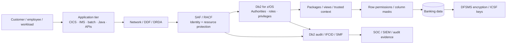

import {CourseProgress, LearningLocationTracker, PracticeChecklist} from '@site/src/components/LearningWidgets';

<LearningLocationTracker />

# ZBSEC1: IBM Db2 for z/OS Banking Security

**Course code:** ZBSEC1  
**Recommended duration:** 48 guided hours  
**Level:** Intermediate to advanced  
**Delivery:** Self-paced, browser-first, with an optional authorised z/OS practice track  
**Mastery threshold:** 80%

ZBSEC1 is designed for people who must secure, administer, assess or audit Db2 for z/OS in a financial-services environment. The course deliberately connects database controls to the surrounding z/OS security and operational ecosystem: SAF/RACF, distributed connectivity, transaction managers, cryptography, audit evidence, privileged access, regulatory obligations and incident response.

<CourseProgress />

## What you will be able to do

By the end of the course you should be able to:

1. Explain the security boundary between z/OS, SAF/RACF, Db2 for z/OS, DDF, application runtimes and data objects.
2. Trace an identity from authentication through primary/secondary authorization IDs to effective Db2 privileges.
3. Design separation of duties between security administration, system/database administration and data access.
4. Secure static SQL packages, plans and common CICS/IMS/batch application patterns.
5. Assess DDF/DRDA connectivity, TLS/AT-TLS, credential handling and remote authorization.
6. Use roles, trusted contexts, row permissions and column masks to enforce fine-grained data policy.
7. Explain DFSMS data-set encryption, ICSF/key-management dependencies and disaster-recovery requirements.
8. Build an auditable evidence chain using Db2 events/IFCIDs, SMF, RACF and SIEM correlation.
9. Apply OWASP guidance to the application/database boundary without pretending OWASP replaces mainframe security controls.
10. Map technical controls to applicable banking, privacy and payment-card requirements.
11. Execute evidence-first incident-response and break-glass playbooks.
12. Produce a defensible security target architecture and control-validation plan for a fictional bank.

## The mental model

Security failures frequently occur when teams understand only one box. A strong practitioner can follow the entire chain and answer four questions:

- **Who is the actor?**
- **What effective authority do they have?**
- **Which data or operation can that authority reach?**
- **What independent evidence proves what happened?**

## Course structure

| Part | Modules | Focus |
|---|---:|---|
| Part 1 | 1–3 | Architecture, banking threat modelling, SAF/RACF, Db2 authority and separation of duties |
| Part 2 | 4–6 | Application packages, CICS/IMS/batch, DDF/DRDA, trusted contexts and fine-grained data access |
| Part 3 | 7–9 | Cryptography/key management, audit/SMF, OWASP-informed secure engineering |
| Part 4 | 10–12 | Regulation/compliance, incident response/tabletops and the capstone architecture |

You also have a **Lab Centre**, a reusable **Playbook Library**, a **Reference Architecture** and a 24-question final assessment.

## Lab model

Each practical activity is labelled as one of two tracks.

### Track A — safe browser simulation

Use synthetic identity, privilege, DDF and SMF evidence provided by this course. No live system is contacted and no production credentials are required.

### Track B — authorised z/OS practice

Repeat the evidence-gathering process in a non-production environment where you have explicit permission. Commands and SQL in the course are examples; subsystem names, RACF class activation, catalog details, function levels and local security standards vary. Validate every command against the IBM documentation and your organisation's runbook before execution.

:::warning Authorisation boundary
Never use this course as permission to enumerate, change or test systems you are not authorised to administer. Security labs should be performed in a dedicated training, sandbox or formally approved non-production environment.
:::

## Evidence-first learning

Do not mark a module complete because you have read it. A completed module should leave evidence such as:

- a trust-boundary diagram;
- a privilege or identity review worksheet;
- a DDF/TLS validation checklist;
- a row/column policy decision record;
- a key-management recovery dependency map;
- an audit query or synthetic event analysis;
- an incident timeline;
- a compliance control-to-evidence matrix.

<PracticeChecklist
  id="orientation-ready"
  title="Prepare your learning workspace"
  items={[
    'Create a private notes/evidence folder for ZBSEC1.',
    'Record whether you have an authorised z/OS practice environment; if not, commit to the browser-simulation track.',
    'Identify your organisation’s security, database, network, IAM/PAM and compliance owners for contextual questions.',
    'Create a glossary page for subsystem-specific terms you encounter.',
    'Agree that no production credential, customer data or cryptographic key material will be pasted into the course or training notes.'
  ]}
/>

## Regulatory usage note

This course includes educational mappings to South African financial-sector requirements, POPIA, PCI DSS and recognised security frameworks. **Those mappings are not legal advice and do not determine your institution's regulatory scope.** A bank's legal, compliance, risk, privacy and payment-card owners must validate applicability, evidence requirements, retention periods and reporting obligations.

## Current platform baseline

ZBSEC1 uses **Db2 13 for z/OS** as the product baseline. Db2 13 is delivered using continuous delivery and function levels, so learners should record both the Db2 release and the activated function level when assessing an environment. Always verify current function-level prerequisites and APAR requirements before relying on a feature.

### Primary references

- IBM Db2 for z/OS 13 documentation: https://www.ibm.com/docs/en/db2-for-zos/13.0.0
- IBM Db2 13 function levels: https://www.ibm.com/docs/en/db2-for-zos/13.0.0?topic=levels-db2-13-function
- OWASP: https://owasp.org/
- PCI Security Standards Council: https://www.pcisecuritystandards.org/
- South African Reserve Bank: https://www.resbank.co.za/
- Information Regulator South Africa: https://inforegulator.org.za/

## Assessment model

- Knowledge checks are formative and can be retried.
- Practical checklists record evidence completion locally in the browser.
- Tabletop exercises test decisions rather than command recall.
- The final assessment contains 24 scenario questions.
- **80% is the mastery threshold.** Scores below 80% should trigger targeted remediation by domain before a retake.

Continue to **Module 1: Architecture, banking threat model & Db2 13 baseline**.
