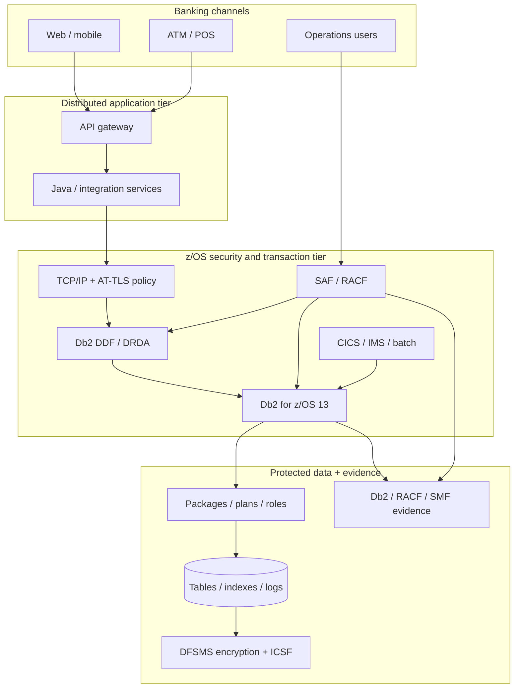
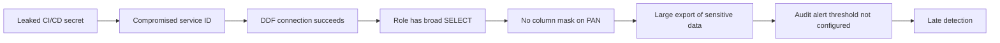

import {CourseProgress, KnowledgeCheck, PracticeChecklist, ScenarioDecision, LessonComplete, LearningLocationTracker} from '@site/src/components/LearningWidgets';

<LearningLocationTracker />

# Module 1: Architecture, banking threat model & Db2 13 baseline

**Recommended time:** 4 hours

<CourseProgress compact />

A bank does not secure “a database” in isolation. It secures a transaction path that can include customer channels, API gateways, middleware, CICS or IMS, batch jobs, DDF, TCP/IP, SAF/RACF, Db2 packages, Db2 data, cryptographic services, operations tooling and audit pipelines. The first skill is therefore **boundary recognition**.

## 1.1 Db2 for z/OS is part of a larger control plane

A simplified production path might look like this:

Every arrow represents an opportunity for control failure: an identity may be over-privileged, a remote path may not meet the bank's transport requirements, a package owner may hold unnecessary rights, a service ID may be shared, a column mask may be missing, or the audit pipeline may fail silently.

## 1.2 Security objectives for banking data

Use the classic CIA model, but extend it for regulated transactional systems:

| Objective | Banking interpretation | Example failure |
|---|---|---|
| Confidentiality | Only authorised actors see permitted customer/payment data | DBA or service ID can query full card/account details without business need |
| Integrity | Transactions and security policy cannot be altered outside authorised processes | Privilege grant or account-balance update is changed without approval |
| Availability | Payment and core-banking services meet resilience objectives | Security change disables DDF or prevents recovery keys from being used at DR |
| Authenticity | The actor/workload identity is trustworthy | Shared service credential obscures the real caller |
| Accountability | Activity can be attributed and reconstructed | Audit evidence cannot link a privileged query to an individual/session |
| Recoverability | Security remains intact during restore/failover | Restored encrypted data is unusable because keys or RACF profiles are absent |

## 1.3 Threat modelling: assets, actors, entry points and trust boundaries

A useful threat model is intentionally concrete.

### Assets

- customer personally identifiable information (PII);
- account and transaction history;
- payment-card data where applicable;
- authentication and authorization data;
- cryptographic keys and key labels;
- Db2 catalogs and security policy objects;
- packages/plans and application deployment artefacts;
- backups, logs and recovery copies;
- audit/SMF records;
- privileged credentials and PAM vault data.

### Actors

- customer-facing applications;
- tellers and operations users;
- batch/service accounts;
- Db2 DBAs;
- z/OS/RACF administrators;
- security administrators;
- application developers and release engineers;
- SOC/audit personnel;
- third-party support personnel;
- malicious or compromised internal/external identities.

### Entry points

- DDF secure/non-secure ports;
- CICS/IMS transaction interfaces;
- batch jobs and scheduler identities;
- administrative consoles and TSO/ISPF paths;
- JDBC/CLI/ODBC clients;
- deployment pipelines and bind/rebind workflows;
- backup and recovery operations;
- RACF/SAF resource administration;
- SMF/SIEM forwarding pipeline.

## 1.4 STRIDE adapted to Db2 banking controls

STRIDE is not a mainframe-specific standard, but it is a useful design prompt.

| Threat | Db2/z/OS example | Control questions |
|---|---|---|
| Spoofing | Stolen application ID used through DDF | How is the credential protected, rotated and bound to an expected path? |
| Tampering | Unauthorised privilege/catalog change | Who can grant/revoke? Is change activity independently audited? |
| Repudiation | Shared DBA ID denies executing a query | Is privileged access individually attributable and session-evidenced? |
| Information disclosure | Broad SELECT exposes customer/card data | Can role/package/view/row/column policy reduce exposure? |
| Denial of service | Misconfigured DDF/TLS or security rule blocks payments | Are changes staged, tested, reversible and monitored? |
| Elevation of privilege | Group membership unexpectedly adds secondary auth ID | Does recertification calculate effective access rather than primary ID only? |

## 1.5 Db2 13 function-level awareness

Db2 13 uses continuous delivery. A security architect therefore needs more than the statement “we run Db2 13”. Record at least:

1. Db2 release and maintenance level;
2. activated function level;
3. required APARs/PTFs for security features in use;
4. subsystem parameters relevant to security;
5. RACF and z/OS dependencies;
6. client/driver levels for distributed access.

As of 2026, Db2 13 security enhancements continue to arrive through function levels and maintenance, including newer identity-token and trusted-context capabilities. **Verify exact prerequisites before designing around a feature.**

## 1.6 Attack paths are chains, not single vulnerabilities

Consider a fictional bank, **Northstar Digital Bank**:

Each control may look acceptable when reviewed alone. The breach becomes possible because the controls fail **in combination**. The course will repeatedly ask you to identify which layer should prevent, constrain, detect and recover from a scenario.

## 1.7 Banking design rule: prevent + constrain + detect + recover

A control should rarely be treated as the only line of defence.

  
<strong>Prevent</strong>
Strong authentication, protected transport, safe bind/deployment, secure configuration.

  
<strong>Constrain</strong>
Least privilege, roles, package interfaces, row permissions, column masks, network segmentation.

  
<strong>Detect</strong>
Db2 audit, RACF/SMF evidence, SIEM correlation, anomalous privileged-access monitoring.

  
<strong>Recover</strong>
Tested break-glass procedures, credential revocation, key recovery, backups/DR and validated restoration.

  
<strong>Govern</strong>
Ownership, recertification, change management, exception handling, control evidence.

  
<strong>Prove</strong>
Repeatable tests that demonstrate the control actually works under the deployed configuration.

## 1.8 Lab: create a banking Db2 threat model

### Track A — browser/worksheet

For Northstar Digital Bank, create a table with at least 15 rows using these columns:

| Asset/process | Threat actor | Entry point | Preventive control | Detective control | Recovery control | Owner | Evidence |
|---|---|---|---|---|---|---|---|

Include at least:

- mobile banking through DDF;
- CICS teller transaction;
- nightly settlement batch;
- DBA privileged maintenance;
- security-administrator privilege change;
- backup/restore;
- cryptographic-key availability;
- SMF forwarding to SIEM.

### Track B — authorised environment

Build an **environment inventory** before running any changes. Capture:

- subsystem identifiers;
- Db2 release/function level;
- DDF status and approved ports;
- authentication/security integration owner;
- data classifications hosted by the subsystem;
- audit policy owner and SMF destination;
- encryption/key-management owner;
- DR subsystem and last security-control recovery test date.

Do not collect credentials, key material or live customer data in the worksheet.

<PracticeChecklist
  id="m1-threat-model"
  title="Module 1 evidence pack"
  items={[
    'I produced a trust-boundary diagram covering application, network, RACF, Db2, data, cryptography and audit.',
    'I identified at least 10 critical banking assets and their owners.',
    'I documented at least 15 threat/control rows.',
    'I identified at least three control-chain failures where two or more weaknesses combine.',
    'I recorded the Db2 release/function-level evidence required before relying on security features.'
  ]}
/>

<ScenarioDecision
  title="The firewall rule is not the security boundary"
  prompt="A reviewer says the banking application is safe because only the application subnet can reach the DDF port. What is the best response?"
  options={[
    {label: 'Accept the network rule as sufficient.', correct: false, feedback: 'Network restriction reduces exposure but does not establish application identity, effective Db2 privilege, data-level policy or audit accountability.'},
    {label: 'Require defense in depth across transport, identity, authorization, data policy and audit.', correct: true, feedback: 'A restricted source network should be one control in a layered access chain, not the entire trust decision.'},
    {label: 'Replace RACF with a database password.', correct: false, feedback: 'The issue is not which single authentication mechanism wins; it is whether the whole control chain is designed and evidenced.'}
  ]}
/>

<KnowledgeCheck
  id="m1-kc1"
  question="Why should a Db2 13 security assessment record the activated function level?"
  options={[
    'Function levels only affect SQL formatting.',
    'Security capabilities and prerequisites can arrive through continuous delivery, so release name alone may not describe the usable feature set.',
    'Function levels replace RACF user IDs.',
    'The function level is only needed for storage calculations.'
  ]}
  correctIndex={1}
  explanation="A design must be based on the capabilities actually activated and maintained in the subsystem, not the product family name alone."
/>

<KnowledgeCheck
  id="m1-kc2"
  question="Which statement best describes a banking Db2 threat model?"
  options={[
    'A list of Db2 vulnerabilities only.',
    'A structured view of assets, actors, entry points, trust boundaries, attack paths, controls, owners and evidence.',
    'A firewall rule set.',
    'A database object inventory without application context.'
  ]}
  correctIndex={1}
  explanation="The model must connect technical components to the business assets and attacker paths they protect."
/>

## Primary references

- IBM Db2 for z/OS 13 documentation: https://www.ibm.com/docs/en/db2-for-zos/13.0.0
- Db2 13 function levels: https://www.ibm.com/docs/en/db2-for-zos/13.0.0?topic=levels-db2-13-function
- NIST Cybersecurity Framework 2.0: https://www.nist.gov/cyberframework
- OWASP Threat Modeling resources: https://owasp.org/www-community/Threat_Modeling

<LessonComplete lessonId="m1" nextHref="/course/module-2-racf-saf-identity" nextLabel="Start Module 2" />
