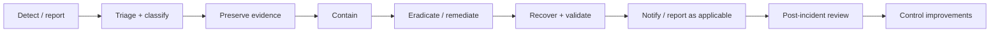
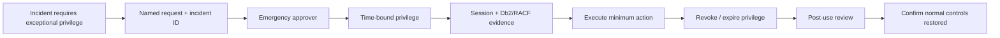

import {CourseProgress, KnowledgeCheck, PracticeChecklist, ScenarioDecision, Tabletop, LessonComplete, LearningLocationTracker} from '@site/src/components/LearningWidgets';

<LearningLocationTracker />

# Module 11: Incident response, PAM, break-glass & tabletop exercises

**Recommended time:** 4 hours

<CourseProgress compact />

A technically correct security architecture can still fail during an incident if the organisation cannot **identify the affected identity, preserve evidence, contain access without destroying recoverability, communicate decisions and restore normal controls**.

## 11.1 Security incident lifecycle

These activities can overlap. For example, urgent containment may occur while evidence collection continues. The incident commander should document why a disruptive action was necessary and what evidence could be lost.

## 11.2 First-response questions for Db2 security events

1. Which business service is affected?
2. Which Db2 subsystem/database/object is involved?
3. Which authorization ID, role, package or trusted context was used?
4. What is the earliest reliable timestamp?
5. Is the actor human, service, batch or transaction-manager identity?
6. Is the credential still active?
7. Can access be contained narrowly without causing a wider outage?
8. Which evidence sources exist: Db2/IFCID, SMF, RACF, PAM, network, application, change management?
9. Is cryptographic material potentially affected?
10. Does the event involve personal information, cardholder data or a regulated critical service?
11. Who owns legal/privacy/regulatory notification decisions?
12. What must be validated before returning to service?

## 11.3 Privileged Access Management (PAM)

A strong PAM model for Db2/z/OS operations aims for:

- named individual identity;
- MFA/strong authentication at the privileged access boundary where supported by the enterprise design;
- approved request and business/incident justification;
- time-bound elevation;
- narrow target/system scope;
- session/activity evidence;
- no shared permanent privileged secret where avoidable;
- automatic expiry/revocation;
- post-use review for high-risk operations;
- emergency access tested before an emergency.

## 11.4 Break-glass is a controlled exception

A shared spreadsheet containing the “emergency SYSADM password” is not a mature break-glass design.

## 11.5 Containment ladder

Prefer the smallest action that stops the threat while preserving critical service and evidence.

| Level | Example | Trade-off |
|---|---|---|
| 1 | Block one user/service identity | Narrowest impact; may not stop alternate credentials |
| 2 | Revoke one role/privilege/package execute path | Contains capability; requires understanding effective access |
| 3 | Restrict one DDF source/path | Useful for compromised application tier; can affect clients |
| 4 | Quarantine an application/service tier | Larger business impact |
| 5 | Stop DDF / subsystem component | Major service impact; use only with incident-command approval |
| 6 | Broader z/OS/network isolation | Extreme containment for severe compromise |

Containment is not a contest to find the most destructive command.

## 11.6 Tabletop 1 — compromised payment service identity

<Tabletop
  title="PAYAPI01 starts behaving differently"
  injects={[
    'SOC detects PAYAPI01 querying a customer table that is not part of its documented payment package.',
    'The source IP is in the approved application subnet, but the workload host is a new container node deployed two hours ago.',
    'The application team discovers the PAYAPI01 secret was present in an old CI log accessible to a wider developer group.',
    'Db2 evidence shows 18,000 rows were selected; the service normally retrieves fewer than 20 rows per transaction.',
    'The customer table contains personal information and a masked card token. Legal/privacy asks whether notification is required.',
    'The payments channel is still operating and management is concerned that disabling PAYAPI01 could stop card authorisations.'
  ]}
  questions={[
    'What evidence do you preserve before rotating or disabling the identity?',
    'Which narrow containment options exist before stopping the payments service?',
    'How do you determine whether the service had direct table privilege, role privilege or package-mediated access?',
    'Which teams own the secret rotation, Db2 privilege and regulatory-notification decisions?',
    'What negative tests are required before restoring the service?'
  ]}
/>

## 11.7 Tabletop 2 — privileged DBA access anomaly

<Tabletop
  title="A DBA reads a high-risk customer table at 02:13"
  injects={[
    'A SIEM rule flags a production DBA authorization ID selecting from a high-risk customer table outside the normal maintenance window.',
    'The DBA states they were investigating a replication issue but cannot provide a change or incident number.',
    'PAM shows a privileged session began at 02:09, but the terminal recording has a four-minute gap.',
    'RACF group evidence indicates the DBA was added to a temporary data-access group three weeks ago and the group membership never expired.',
    'A second query selected an ID-number column normally masked from support personnel.',
    'The manager asks the incident team to delete the DBA account immediately.'
  ]}
  questions={[
    'Which facts indicate control failure even if the DBA had a legitimate operational reason?',
    'What evidence must be preserved before account deletion?',
    'How should the temporary group membership have been governed?',
    'What containment preserves accountability while preventing further sensitive access?',
    'Which SoD and PAM controls need remediation after the event?'
  ]}
/>

## 11.8 Tabletop 3 — cryptographic recovery failure

<Tabletop
  title="Encrypted Db2 data is replicated, but DR cannot open it"
  injects={[
    'A regional outage triggers DR. Storage reports all Db2 data sets replicated successfully.',
    'Db2 recovery fails when an encrypted data set cannot be opened under the DR environment.',
    'The expected key label is referenced, but the cryptographic team cannot find the corresponding usable key in the DR service.',
    'A security administrator suggests temporarily granting broad access to all key labels while the issue is investigated.',
    'The payment RTO has 45 minutes remaining.',
    'The missing key was created during a production change six months ago; the DR dependency record was never updated.'
  ]}
  questions={[
    'Which teams must be in the incident bridge immediately?',
    'How do you avoid turning an availability event into a cryptographic-control breach?',
    'What exact dependency evidence should have been captured at key creation time?',
    'What is the minimum viable recovery test after key access is restored?',
    'Which governance process should ensure new keys are propagated to recovery capability?'
  ]}
/>

## 11.9 Regulatory/privacy notification decision process

Technical responders should **not independently decide legal notification**. They provide factual evidence to the accountable function.

Provide:

- what happened and when;
- affected systems/data classifications;
- identities and access paths;
- number/types of records potentially affected;
- whether data was viewed, altered, exfiltrated or only potentially exposed;
- containment actions and timestamps;
- cryptographic state;
- evidence confidence and known gaps;
- service impact;
- ongoing risk.

Privacy/legal/regulatory owners then determine applicable notifications and timelines.

## 11.10 Post-incident control verification

Do not close the incident when the password is changed.

Verify:

- compromised credential/token revoked everywhere;
- unintended groups/roles/privileges removed;
- trusted-context/source restrictions correct;
- package/object access restored to approved baseline;
- audit/detection rules functioning;
- leaked secret removed from accessible logs/repositories where feasible;
- dependent systems updated;
- no emergency privilege remains;
- recovery/business service validated;
- root cause and contributing control failures documented;
- control owner accepts remediation plan.

<PracticeChecklist
  id="m11-ir"
  title="Incident-response evidence pack"
  items={[
    'I completed all three table-top exercises and recorded decision rationales.',
    'I defined a containment ladder from narrow identity action to major subsystem isolation.',
    'I documented a break-glass flow with named identity, approval, time limit, evidence, expiry and post-review.',
    'I can name the evidence sources to preserve before destructive remediation.',
    'I separated technical fact gathering from legal/privacy/regulatory notification decisions.',
    'I created a post-incident validation checklist that confirms normal security controls are restored.'
  ]}
/>

<ScenarioDecision
  title="Delete the account now"
  prompt="A privileged identity is suspected of misuse. Management asks for immediate account deletion before the investigation team has preserved session and authorization evidence."
  options={[
    {label: 'Delete it immediately in every case.', correct: false, feedback: 'Urgent containment may be necessary, but destructive identity changes can remove context or complicate attribution. Preserve evidence and use the narrowest safe containment when operationally possible.'},
    {label: 'Preserve critical evidence, assess active threat, contain access quickly using the least destructive effective control, then perform coordinated revocation/remediation.', correct: true, feedback: 'Incident response balances evidence, containment and business risk. Document any action that must precede evidence capture due to immediate threat.'},
    {label: 'Do nothing until the full forensic report is complete.', correct: false, feedback: 'Evidence preservation does not mean leaving an active compromised identity unrestricted.'}
  ]}
/>

<KnowledgeCheck
  id="m11-kc1"
  question="What makes break-glass access defensible?"
  options={[
    'A shared password held by the DBA manager.',
    'Named, justified, approved, time-bound elevation with activity evidence, expiry/revocation and post-use review.',
    'Permanent SYSADM for everyone on call.',
    'Disabling audit so responders can work faster.'
  ]}
  correctIndex={1}
  explanation="Emergency speed and accountability are compatible when the exceptional privilege is controlled as a short-lived, evidenced workflow."
/>

<KnowledgeCheck
  id="m11-kc2"
  question="Who should decide whether a security incident triggers a legal or regulator notification?"
  options={[
    'The individual DBA who detected it.',
    'The organisation’s accountable legal/privacy/compliance/regulatory decision process using evidence supplied by technical responders.',
    'The application developer.',
    'No one until the annual audit.'
  ]}
  correctIndex={1}
  explanation="Technical teams establish facts and impact; notification obligations require authorised legal, privacy, compliance and regulatory interpretation."
/>

## Primary references

- NIST Cybersecurity Framework 2.0: https://www.nist.gov/cyberframework
- NIST Computer Security Incident Handling Guide resources: https://csrc.nist.gov/
- Information Regulator South Africa — POPIA: https://inforegulator.org.za/popia/
- FSCA supervisory information: https://www.fsca.co.za/Regulatory%20Frameworks/Pages/Supervisory-Information.aspx

<LessonComplete lessonId="m11" nextHref="/course/module-12-capstone" nextLabel="Start the capstone" />
