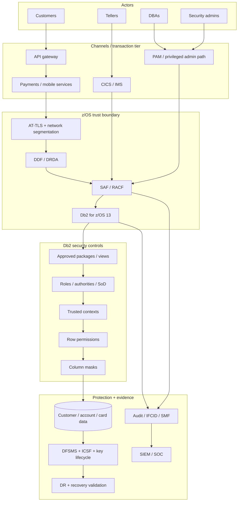

import {CourseProgress, KnowledgeCheck, PracticeChecklist, ScenarioDecision, LessonComplete, LearningLocationTracker} from '@site/src/components/LearningWidgets';

<LearningLocationTracker />

# Module 12: Capstone — Secure Northstar Digital Bank

**Recommended time:** 4 hours

<CourseProgress compact />

The capstone requires you to turn the previous 11 modules into one operating security model. You are the security/Db2 architecture team for **Northstar Digital Bank**, a fictional South African bank modernising its customer and payments platform while retaining Db2 for z/OS as a system of record.

## 12.1 Environment brief

Northstar has:

- Db2 13 for z/OS production and DR subsystems;
- mobile and web banking through Java services using DDF/DRDA;
- CICS teller transactions;
- IMS-backed legacy processes;
- nightly and intraday batch settlement;
- cardholder and personal information in critical tables;
- RACF as the z/OS security manager;
- DFSMS data-set encryption and ICSF-based cryptographic services;
- a PAM platform for human privileged access;
- central SMF collection and SIEM;
- PCI DSS scope for card-payment systems;
- POPIA and applicable South African financial-sector regulatory obligations.

## 12.2 Current-state findings

Your assessment finds:

1. Three DBAs hold SYSADM and direct sensitive-table SELECT.
2. `PAYAPI01` uses a long-lived shared credential stored in an application configuration repository.
3. The payments application has direct SELECT on `CUSTOMER`, `ACCOUNT` and `CARD` base tables.
4. A DDF TLS certificate expires in 35 days; the renewal owner left the company.
5. Several CICS transactions use one broad region-level database identity.
6. A temporary RACF group membership created for an incident six months ago remains active.
7. Row permissions are not used for branch/teller access; filtering is only in application code.
8. Card PAN is returned in full to a service that displays only the last four digits.
9. Db2 audit evidence is written to SMF, but the SOC has no rule for privileged reads of the card table.
10. The DR site has not tested the newest encryption key dependency.
11. Developers can submit production package rebind requests through a shared deployment account.
12. Access recertification checks direct grants but does not calculate secondary IDs, roles or package execution paths.

## 12.3 Target architecture

Produce an architecture based on this pattern, then adapt it to the case:



## 12.4 Required capstone deliverables

### Deliverable A — architecture and trust boundaries

Include:

- customer/application/transaction-manager channels;
- privileged administration;
- DDF/TLS boundary;
- SAF/RACF identity boundary;
- Db2 authorization/package boundary;
- row/column policy;
- cryptography/key services;
- audit/SIEM;
- DR dependencies.

### Deliverable B — identity and privilege matrix

For at least these personas:

- teller;
- call-centre user;
- fraud analyst;
- production system DBA;
- SECADM/security administrator;
- auditor;
- `PAYAPI01`;
- CICS/IMS runtime identity;
- batch settlement identity;
- break-glass identity.

Document primary/secondary auth context, role/package access, direct table access, sensitive-column exposure, approval, expiry/recertification and monitoring.

### Deliverable C — remediation backlog

Rank all 12 findings with:

```text
Risk statement
Affected asset/service
Likelihood / exploitability
Business impact
Regulatory/control relevance
Immediate containment
Target control
Owner
Due date / dependency
Validation test
Evidence of closure
Residual risk
```

Use a transparent risk method rather than arbitrary “critical/high” labels.

### Deliverable D — control test plan

Include at least 20 tests across:

- authentication failures;
- secondary/group-derived authorization;
- SYSADM/SECADM SoD;
- package EXECUTE and forbidden direct table access;
- DDF TLS/authentication;
- trusted-context source mismatch;
- row permission positive/negative tests;
- column-mask personas;
- service secret rotation;
- privileged activity alert;
- security grant alert;
- key/DR recovery;
- break-glass expiration;
- post-incident restoration of normal controls.

### Deliverable E — evidence matrix

Map each control to:

- configuration source;
- test evidence;
- runtime evidence;
- owner;
- retention;
- independent reviewer.

### Deliverable F — incident playbook

Choose one:

1. compromised `PAYAPI01`;
2. unauthorized privileged DBA access;
3. DDF/TLS outage during peak payments;
4. missing cryptographic key at DR;
5. suspected SQL injection with bulk data read.

Your playbook must include trigger, triage, evidence, containment ladder, regulatory/privacy decision inputs, recovery validation and post-incident controls.

## 12.5 Architecture decision records

Write at least five ADRs (Architecture Decision Records).

Suggested ADR topics:

- **ADR-001:** system DBADM versus SYSADM for normal DBA operations;
- **ADR-002:** package/view interface instead of base-table grants for `PAYAPI01`;
- **ADR-003:** branch-level row permission design;
- **ADR-004:** PAN column masking/tokenisation strategy;
- **ADR-005:** DDF certificate ownership and renewal SLO;
- **ADR-006:** privileged read detection rule;
- **ADR-007:** cryptographic key propagation to DR.

ADR template:

```text
Title
Status
Context / problem
Decision
Alternatives considered
Security consequences
Operational consequences
Compliance/evidence impact
Validation plan
Owner / review date
```

## 12.6 Capstone scoring rubric

Score yourself 0–4 in each category.

| Domain | 0 | 2 | 4 |
|---|---|---|---|
| Architecture | No trust-boundary model | Components shown | End-to-end trust, admin, crypto, evidence and DR boundaries are explicit |
| Identity | Login IDs only | Groups/roles partly mapped | Primary/secondary IDs, NHI ownership, source and recertification fully mapped |
| Authorization | Broad admin/data roles | Some least privilege | SoD, package access, negative tests and break-glass are proven |
| Data controls | App filtering only | Some views/masks | Role + package + row + column policy with persona tests |
| Network | DDF port listed | TLS described | Source segmentation, AT-TLS/cert lifecycle/auth outcome and negative tests |
| Cryptography | “Encrypted” | Key owner known | Key lifecycle, RACF/ICSF dependency and DR test evidence complete |
| Detection | Logs exist | Some alerts | Privileged/data/security-change detections correlated across sources |
| Compliance | Standards listed | Some mapping | Scope → requirement → control → test → evidence → owner traceability |
| Incident response | Generic IR plan | Db2 actions listed | Evidence-first containment, notification inputs, recovery and control restore |
| Governance | Owners unclear | Some ownership | RACI, expiry, recertification, exceptions and independent review defined |

**Target:** at least **32/40** with no zero in any domain.

## 12.7 Board/executive briefing

Create a one-page briefing that avoids platform jargon where possible. It should answer:

- What customer/payment risks exist now?
- Which three control-chain failures matter most?
- What could cause material service outage?
- Which remediation reduces the most risk in 30 days?
- Which controls require investment across teams, not only Db2?
- How will management know the remediation actually works?

## 12.8 Lab submission checklist

<PracticeChecklist
  id="m12-capstone"
  title="Capstone completion"
  items={[
    'I produced an end-to-end target architecture and trust-boundary diagram.',
    'I created an effective identity/privilege matrix for at least 10 personas/workloads.',
    'I prioritised all 12 findings in a transparent remediation backlog.',
    'I wrote at least 20 positive/negative/recovery/detection control tests.',
    'I mapped each critical control to configuration, test and runtime evidence.',
    'I wrote at least five architecture decision records.',
    'I completed one incident playbook.',
    'I scored at least 32/40 on the capstone rubric with no zero domain.',
    'I prepared a one-page executive risk briefing.'
  ]}
/>

<ScenarioDecision
  title="Choose the first 30-day control improvement"
  prompt="Northstar can fund only one major control project immediately. Which option provides the strongest cross-cutting risk reduction from the current-state findings?"
  options={[
    {label: 'Add more Db2 CPU capacity.', correct: false, feedback: 'Capacity may improve performance but does not address the dominant identity, privilege, secret, data-exposure and evidence risks.'},
    {label: 'Establish an identity/least-privilege remediation programme covering service secrets, effective access, DBA SoD, package interfaces and recertification, with detection evidence.', correct: true, feedback: 'This addresses several linked attack paths and creates a foundation for the fine-grained, network and monitoring controls that follow.'},
    {label: 'Disable all distributed banking access indefinitely.', correct: false, feedback: 'This removes business service rather than building a secure operating model.'}
  ]}
/>

<KnowledgeCheck
  id="m12-kc1"
  question="What makes a Db2 banking security architecture defensible?"
  options={[
    'A list of security products.',
    'Traceable trust boundaries, least-privilege decisions, control ownership, positive/negative tests, runtime evidence and recovery capability tied to business risk.',
    'SYSADM assigned to the operations team.',
    'Encryption enabled with no key documentation.'
  ]}
  correctIndex={1}
  explanation="A defensible architecture shows why controls exist, who owns them, how they interact, how they are tested and what evidence proves they continue to work."
/>

<KnowledgeCheck
  id="m12-kc2"
  question="Why should a capstone include both technical test results and an executive briefing?"
  options={[
    'Executives need SQL syntax.',
    'Security engineering must both prove controls technically and communicate business risk, priority, dependency and assurance to accountable decision-makers.',
    'The executive briefing replaces evidence.',
    'Technical teams should not discuss risk.'
  ]}
  correctIndex={1}
  explanation="Banking security is an operating and governance discipline; technical evidence supports decisions that must be understood by risk and business owners."
/>

## Primary references

Re-use the authoritative sources from Modules 1–11 and verify the current Db2 13 function level, local regulatory scope and institutional security standards before treating the capstone as a production design.

<LessonComplete lessonId="m12" nextHref="/course/lab-centre" nextLabel="Open Lab Centre" />
