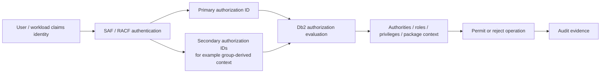
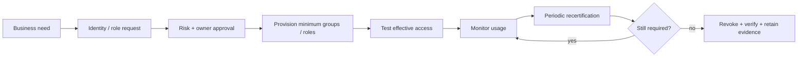

import {CourseProgress, KnowledgeCheck, PracticeChecklist, ScenarioDecision, EvidenceConsole, LessonComplete, LearningLocationTracker} from '@site/src/components/LearningWidgets';

<LearningLocationTracker />

# Module 2: SAF/RACF identity and Db2 authorization IDs

**Recommended time:** 4 hours

<CourseProgress compact />

The first question in every access review is **identity**. In a z/OS banking environment, Db2 commonly relies on SAF and a security product such as RACF to establish and manage identity, group membership and protected-resource access. Db2 then evaluates its own authorization model using the authorization IDs that apply to the request.

## 2.1 Authentication is not authorization



**Authentication** answers: *Who is this actor or workload?*  
**Authorization** answers: *What may that identity do in this context?*

A password, PassTicket, certificate-associated identity or other accepted authentication mechanism is not itself proof that the actor should read an account table. Conversely, a perfectly designed Db2 role is ineffective if the wrong workload can impersonate the identity to which it is mapped.

## 2.2 Primary and secondary authorization IDs

A primary authorization ID represents the main identity Db2 sees for a request. Depending on connection and subsystem configuration, additional authorization IDs can contribute to the effective privilege set.

This is why the following access-review statement is weak:

> “BANKTELL does not have SELECT on the customer table.”

The reviewer must ask:

1. What is the primary authorization ID?
2. Which secondary authorization IDs are active?
3. Which Db2 roles can become active in the connection context?
4. Are privileges inherited through groups, roles, packages or trusted contexts?
5. Does the application execute static SQL under a package privilege set?
6. Which special or administrative authorities apply?

The real question is **effective access**.

## 2.3 SAF as the integration boundary

SAF provides the z/OS interface through which security decisions can be delegated to the configured external security manager. RACF is IBM's z/OS Security Server component commonly used for this purpose.

For a banking security design, SAF/RACF can be involved in:

- authenticating users and workloads;
- managing group membership;
- protecting Db2-related resources;
- controlling who can issue certain Db2 commands or connect through defined paths;
- protecting cryptographic/key-related resources;
- generating security audit evidence for correlation with Db2 activity.

Do not assume that Db2 catalog privileges are the only access-control layer.

## 2.4 RACF groups are security architecture, not organisational decoration

A weak design mirrors an HR organisation chart directly and allows nested or historical group membership to accumulate. A stronger design creates **access-oriented groups** with clear ownership and recertification criteria.

Example conceptual structure:

```text
BANK-DB2-PROD-OPS-READ
BANK-DB2-PROD-DBA-SYSTEM
BANK-DB2-PROD-SECADM
BANK-DB2-PROD-AUDIT
BANK-DB2-APP-PAYMENTS-RUNTIME
BANK-DB2-APP-FRAUD-RUNTIME
```

Naming conventions vary by institution. The design principle is that a reviewer can understand:

- environment;
- platform/application;
- access purpose;
- privilege tier;
- owner;
- approval path;
- recertification period.

## 2.5 DSNR resource protection

RACF's `DSNR` general resource class is commonly used to protect Db2 subsystem resources. A banking team should understand the local naming convention and which profiles control administrative or connection-related capabilities.

A review should verify:

- the relevant RACF class is active as required by the organisation's design;
- profiles are sufficiently specific;
- access is granted to controlled groups rather than broad populations;
- generic profiles do not accidentally cover more subsystems/resources than intended;
- profile changes are audited and linked to change/identity governance;
- test and production profiles cannot be confused.

:::caution Local configuration varies
Do not copy a RACF profile name from a training example into production. Resource names and subsystem conventions are installation-specific, and class/profile design must be validated with the z/OS security team and IBM documentation.
:::

## 2.6 Human identities vs non-human identities

Banking Db2 environments have both.

| Identity type | Examples | Major risks |
|---|---|---|
| Human | DBA, security admin, operator, auditor | privilege accumulation, shared IDs, dormant access, break-glass misuse |
| Application | Java service, CICS region, IMS transaction path | long-lived secret, broad privilege, poor identity propagation |
| Batch | scheduler/job identity, settlement workload | unattended privilege, inherited groups, weak ownership |
| Platform/service | monitoring, backup, automation | forgotten credentials, privilege creep, weak rotation |

For non-human identities, document an **owner, purpose, allowed source, privilege set, secret/token mechanism, rotation process, monitoring rule and offboarding condition**.

## 2.7 Identity lifecycle playbook



Provisioning without recertification is incomplete. Offboarding without testing that access has actually disappeared is also incomplete.

## 2.8 Practical lab: identity and effective-access review

<EvidenceConsole commands={['RACF identity review', 'Db2 privilege review']} />

### Track A tasks

Using the synthetic evidence above, answer:

1. Which fact proves the user is not directly privileged at RACF special-operation level?
2. Which facts are still missing before you can claim the user has no access to sensitive Db2 data?
3. What additional group/role/package evidence would you request?
4. Which owner should certify the access: line manager only, or a combination of business/data/security owners?
5. What should be retained as proof of recertification?

### Track B — authorised RACF/Db2 review

Examples of evidence-gathering commands your z/OS security team may use include RACF user/group/profile display functions such as `LISTUSER`, `LISTGRP`, `RLIST` and `SEARCH`. Exact syntax, authority and resource names are local. Keep the lab **read-only** unless a formally approved change is part of your training environment.

For Db2, collect read-only catalog evidence for:

- user/system authorities;
- database/table privileges;
- package execution/bind privileges;
- roles and trusted-context mappings where applicable.

Record the **source query, timestamp, subsystem and reviewer**, not just a screenshot.

<PracticeChecklist
  id="m2-effective-access"
  title="Effective-access evidence pack"
  items={[
    'I can distinguish authentication from Db2 authorization.',
    'I documented the primary authorization ID for my sample identity.',
    'I identified all relevant secondary/group-derived authorization context available to the review.',
    'I identified role, package and trusted-context paths that could change effective access.',
    'I documented owner, purpose, expiry/recertification and evidence for a non-human application identity.',
    'I reviewed the applicable DSNR/resource-profile design with production/test scope clearly separated.'
  ]}
/>

<ScenarioDecision
  title="The user has no direct grant"
  prompt="An auditor finds no direct SELECT grant for a teller's primary authorization ID and concludes the teller cannot access customer data. What is the best next step?"
  options={[
    {label: 'Accept the conclusion.', correct: false, feedback: 'Direct grants are only one path. Group/secondary IDs, roles, packages and trusted contexts can contribute to effective access.'},
    {label: 'Calculate effective authorization across all applicable identity and Db2 privilege paths.', correct: true, feedback: 'A defensible access review proves the effective privilege set in the connection/application context.'},
    {label: 'Grant SELECT temporarily to test it.', correct: false, feedback: 'Do not create extra privilege to test an access hypothesis; use read-only evidence and approved test identities.'}
  ]}
/>

<KnowledgeCheck
  id="m2-kc1"
  question="What is the central difference between RACF authentication and Db2 authorization?"
  options={[
    'Authentication proves an identity; authorization determines permitted operations for that identity/context.',
    'Authentication grants SYSADM; authorization validates a password.',
    'They are the same control with different names.',
    'Authorization happens before identity is established.'
  ]}
  correctIndex={0}
  explanation="A secure design first establishes who/what is connecting, then evaluates the privileges and authorities that apply to the requested operation."
/>

<KnowledgeCheck
  id="m2-kc2"
  question="Why are shared non-human identities risky in a bank?"
  options={[
    'They use less CPU.',
    'They can obscure accountability and often accumulate long-lived, over-broad privilege unless ownership, source, secret lifecycle and monitoring are explicit.',
    'RACF cannot represent application IDs.',
    'Db2 cannot audit application activity.'
  ]}
  correctIndex={1}
  explanation="Non-human identities need the same lifecycle rigor as people, plus controls for source restriction, secret/token rotation and workload attribution."
/>

## Primary references

- IBM Db2 for z/OS security: https://www.ibm.com/docs/en/db2-for-zos/13.0.0?topic=security
- IBM Db2 authorization IDs: https://www.ibm.com/docs/en/db2-for-zos/13.0.0?topic=privileges-authorization-ids
- IBM z/OS Security Server RACF documentation: https://www.ibm.com/docs/en/zos/3.1.0?topic=server-security-racf
- OWASP Non-Human Identities Top 10: https://owasp.org/www-project-non-human-identities-top-10/

<LessonComplete lessonId="m2" nextHref="/course/module-3-db2-authorities-sod" nextLabel="Start Module 3" />
