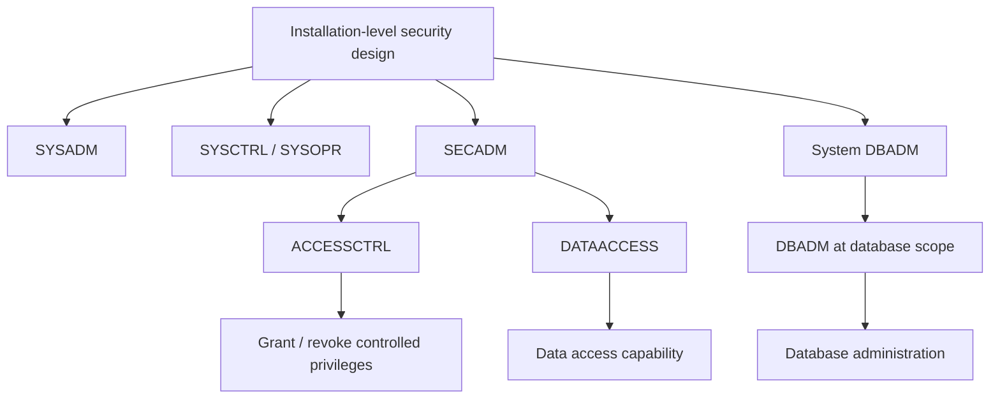
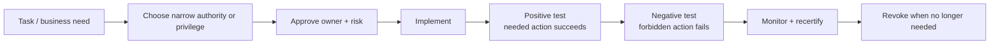

import {CourseProgress, KnowledgeCheck, PracticeChecklist, ScenarioDecision, EvidenceConsole, LessonComplete, LearningLocationTracker} from '@site/src/components/LearningWidgets';

<LearningLocationTracker />

# Module 3: Db2 authorities, roles, privileges & separation of duties

**Recommended time:** 4 hours

<CourseProgress compact />

The security objective is not “make the DBA powerful enough.” It is **give each operational role enough authority to perform its controlled task without inheriting unrelated power over banking data or security policy**.

## 3.1 Authority is not the same as privilege

- **Authorities** are broad administrative capabilities.
- **Privileges** permit operations on specific resources or object types.
- **Roles** aggregate privileges/authorities for controlled use in supported contexts.
- **Ownership** can influence which privileges apply to objects/packages.
- **Package execution** can provide an application interface without granting every caller direct access to base tables.

A mature design uses the narrowest appropriate mechanism rather than reaching automatically for SYSADM.

## 3.2 Administrative authority map

This is a conceptual relationship, not a statement that every authority literally inherits every other authority. Use the IBM authority tables for exact capability rules.

## 3.3 Security-relevant administrative authorities

| Authority | Security design focus | Banking risk if overused |
|---|---|---|
| SYSADM | Broad subsystem administration | Collapses operational and data/security power if assigned as default support role |
| SECADM | Security administration including sensitive policy objects | Can change security policy; must be tightly controlled and independently audited |
| System DBADM | System/database administration without automatically requiring broad application-data access | Valuable for separation of DBA operations from business-data access |
| DBADM | Administrative capability at database scope | Scope may still be broader than a support task needs |
| ACCESSCTRL | Grant/revoke access privileges in its scope | Misuse can create indirect privilege escalation |
| DATAACCESS | Access to data in its scope | High confidentiality risk when combined unnecessarily with administration |

The exact operations allowed depend on Db2 version/function level, subsystem settings and object scope. Validate against current IBM documentation.

## 3.4 `SEPARATE_SECURITY`

Db2 for z/OS supports separation between system administration and security administration. When the subsystem is configured with `SEPARATE_SECURITY=YES`, the intention is to prevent SYSADM from simply becoming the security administrator for objects such as roles, trusted contexts, row permissions and column masks or from overriding security-administration boundaries that should belong to SECADM.

A banking security review should ask:

- Is separation of security enabled where required by the bank's control design?
- Which identities hold SECADM?
- Which identities hold SYSADM?
- Does any human or service identity hold both without a documented exception?
- Are emergency/break-glass privileges time-bound and attributable?
- Is the privilege design independently reviewed?

## 3.5 Separation-of-duties matrix

A useful target model:

| Activity | Security admin | Db2 system DBA | Data/application owner | Auditor/SOC |
|---|---:|---:|---:|---:|
| Manage roles / row permissions / column masks | R | C | A/C | I |
| Maintain subsystem/database availability | C | R/A | I | I |
| Approve access to customer data | C | I | R/A | I |
| Execute approved schema/index maintenance | I/C | R | A/C | I |
| Grant application runtime access | R/C | I | A | I |
| Review privileged activity | I | I | I | R/A |
| Emergency access approval | C | R (user) | A/C | I |

**R = Responsible, A = Accountable, C = Consulted, I = Informed.** Your institution's governance model may assign different roles; the value of the matrix is explicit ownership and conflict detection.

## 3.6 Toxic combinations

A “toxic combination” is not necessarily a technical error. It is a combination of privileges that defeats an intended control.

Examples to review:

- SYSADM + unrestricted business-data access + ability to erase/disable relevant audit evidence;
- SECADM + direct responsibility for certifying their own security grants;
- developer production bind/change capability + production data access;
- application service ID + ability to grant itself additional privileges;
- database operations account + RACF SPECIAL or equivalent broad security power without documented need;
- auditor account + change privilege on the evidence source being audited.

## 3.7 Least privilege is a lifecycle

Negative testing is essential. If you test only that a DBA *can* perform REORG, you have not proved that the DBA *cannot* read a restricted customer table.

## 3.8 Lab: build an administrative access model

<EvidenceConsole commands={['Db2 privilege review', 'SMF audit sample']} />

Create a role matrix for these fictional personnel:

- Maya — z/OS/RACF security administrator;
- Thabo — production Db2 system DBA;
- Ana — payments application owner;
- Luis — application developer;
- Neo — SOC analyst;
- Priya — internal auditor;
- `PAYAPI01` — payments service identity.

For each, define:

1. required job task;
2. Db2 authority/privilege needed;
3. RACF/group context;
4. data access permitted;
5. data access explicitly forbidden;
6. who approves access;
7. who reviews usage;
8. recertification/expiry rule;
9. emergency-access handling.

### Required negative tests

Write at least five **negative test cases** such as:

- System DBA can display/maintain the database but cannot SELECT full cardholder data.
- Developer can bind an approved package in non-production but cannot bind or execute uncontrolled code in production.
- Auditor can retrieve evidence but cannot change security policy.
- Service ID can execute its approved package but cannot grant privileges.
- Security administrator can manage masks/permissions but does not automatically gain business-data access.

<PracticeChecklist
  id="m3-sod"
  title="Administrative least-privilege evidence"
  items={[
    'I produced a RACI or equivalent separation-of-duties matrix.',
    'I listed all identities with SYSADM and SECADM in the fictional/current scope and identified conflicts.',
    'I documented whether SEPARATE_SECURITY is part of the target control design.',
    'I separated system administration from DATAACCESS where operationally feasible.',
    'I wrote at least five negative authorization tests.',
    'I documented break-glass ownership, time limit, evidence and post-use review.'
  ]}
/>

<ScenarioDecision
  title="Production DBA troubleshooting request"
  prompt="A production DBA requests DATAACCESS because a customer complaint is difficult to diagnose. The DBA already has the administrative authority needed to inspect subsystem and database state. What is the strongest first response?"
  options={[
    {label: 'Grant permanent DATAACCESS because DBAs are trusted.', correct: false, feedback: 'Trust does not replace least privilege or separation of duties. Permanent data access can create an unnecessary toxic combination.'},
    {label: 'Find a data-minimising troubleshooting path; if sensitive data access is genuinely required, use an approved time-bound, attributable exception with audit and post-review.', correct: true, feedback: 'Troubleshooting should preserve the intended administrative/data-access separation while still allowing controlled exceptions when justified.'},
    {label: 'Give the DBA the application owner account instead.', correct: false, feedback: 'Account sharing worsens accountability and creates another uncontrolled privilege path.'}
  ]}
/>

<KnowledgeCheck
  id="m3-kc1"
  question="What is the main security objective of separating SECADM from SYSADM?"
  options={[
    'Improve index performance.',
    'Prevent one broad administrative role from automatically controlling both system operation and sensitive security policy.',
    'Disable package execution.',
    'Replace RACF group administration.'
  ]}
  correctIndex={1}
  explanation="Separation of duties reduces the power concentrated in one identity and makes policy changes independently governable and auditable."
/>

<KnowledgeCheck
  id="m3-kc2"
  question="Why is a negative authorization test important?"
  options={[
    'It proves a required action succeeds.',
    'It proves an action outside the intended role is actually denied, which validates the boundary rather than only functionality.',
    'It replaces access recertification.',
    'It removes the need for audit logging.'
  ]}
  correctIndex={1}
  explanation="A least-privilege design must prove both sides: necessary activity succeeds and unnecessary activity is rejected."
/>

## Primary references

- IBM: Managing administrative authorities: https://www.ibm.com/docs/en/db2-for-zos/13.0.0?topic=privileges-managing-administrative-authorities
- IBM: SECADM authority: https://www.ibm.com/docs/en/db2-for-zos/13.0.0?topic=privileges-secadm-authority
- IBM: Separating SYSADM authority: https://www.ibm.com/docs/en/db2-for-zos/13.0.0?topic=authorities-separating-sysadm-authority
- IBM Db2 for z/OS 13 security: https://www.ibm.com/docs/en/db2-for-zos/13.0.0?topic=security

<LessonComplete lessonId="m3" nextHref="/course/module-4-packages-cics-ims" nextLabel="Start Module 4" />
