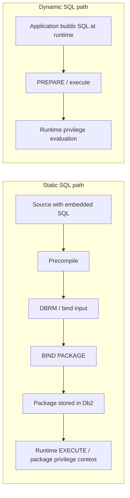
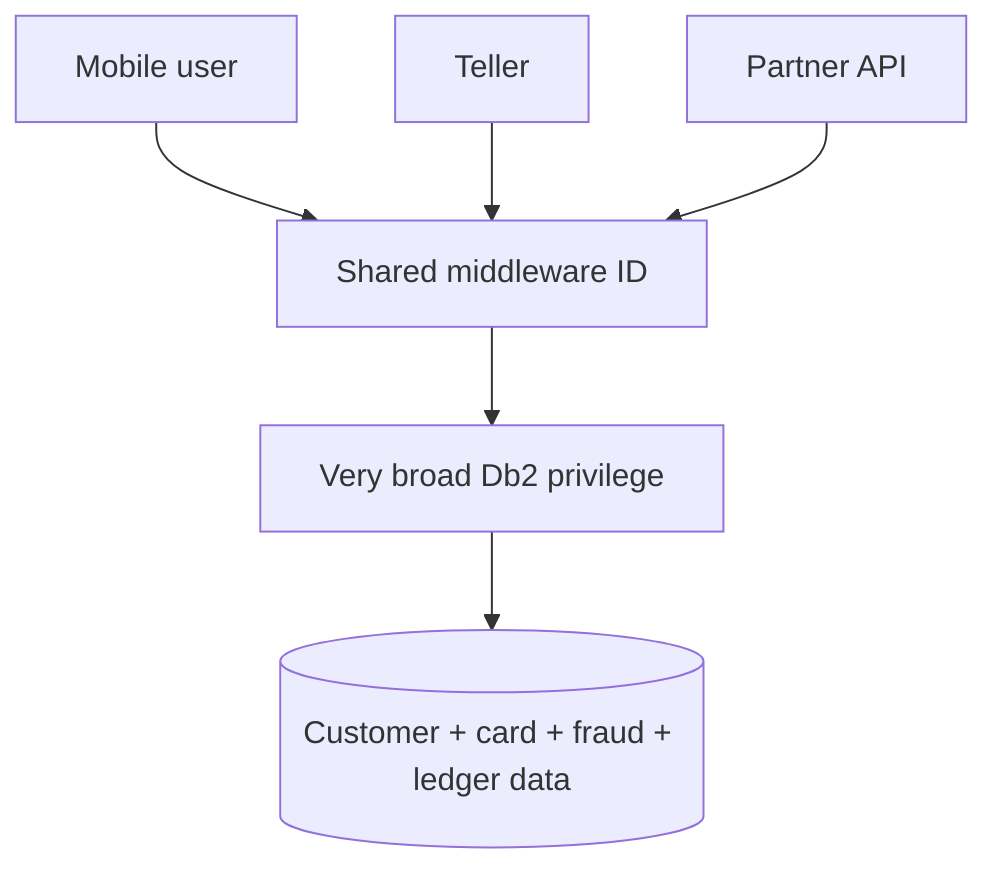

import {CourseProgress, KnowledgeCheck, PracticeChecklist, ScenarioDecision, LessonComplete, LearningLocationTracker} from '@site/src/components/LearningWidgets';

<LearningLocationTracker />

# Module 4: Packages, plans, static SQL, CICS, IMS & batch identities

**Recommended time:** 4 hours

<CourseProgress compact />

Banking applications often reach Db2 through controlled application artefacts rather than ad-hoc direct SQL. Understanding packages, plans, bind/rebind and transaction-manager identity is therefore a security skill, not only an application-development topic.

## 4.1 Static vs dynamic SQL: the security consequence

With static SQL, the SQL text and bind process create a controlled executable database interface. With dynamic SQL, statements are prepared at runtime and authorization depends on the applicable runtime context. Exact privilege-set rules depend on package/plan ownership, bind options and connection context; always validate the actual package and IBM authorization rules.

## 4.2 Why packages matter to least privilege

A package can help a bank expose **approved database operations** without granting every caller unrestricted direct access to all underlying objects.

A strong application design asks:

- Which collection/package is the official interface?
- Who owns the package?
- Who may BIND/REBIND it?
- Who may EXECUTE it?
- Which tables, views, routines and roles does it require?
- Are dynamic SQL capabilities necessary inside the application?
- Is the package deployment tied to source control and release approval?
- Can a developer introduce new SQL into production without independent review?

## 4.3 Bind is a privileged software-supply-chain event

Treat package creation and rebind as production changes.

Security controls should cover:

1. source integrity;
2. build identity;
3. separation between developer and production deployer;
4. BINDADD/BIND/REBIND authority as applicable;
5. collection/package naming standards;
6. release/change ticket linkage;
7. package owner and privilege-set review;
8. rollback/rebind strategy;
9. post-deployment validation and audit.

## 4.4 CICS, IMS and batch: where is the user identity?

A bank may have thousands of end users but a smaller number of technical connections or address spaces. The security design must state where user/workload identity is preserved, transformed or intentionally shared.

### CICS

Questions to ask:

- Is the Db2 request executed under a CICS region/transaction identity or an end-user-related authorization context?
- Which transaction/profile controls determine who can invoke the business operation?
- Does Db2 audit evidence allow correlation to the originating transaction/user where required?
- Can the region identity perform SQL outside the approved package/interface?

### IMS

Questions are similar: determine how the transaction/user is authenticated, how the Db2 authorization ID is derived, which packages execute, and how activity is attributed.

### Batch

Batch can be especially powerful because it often runs unattended.

Review:

- scheduler/job owner;
- submitted user/job identity;
- dataset and JCL protection;
- package/Db2 privileges;
- secrets/tokens used by dependent services;
- output spool/data exposure;
- restart/recovery behaviour;
- audit correlation to the business process.

## 4.5 Avoid the “one powerful application ID” anti-pattern

This may be operationally simple but it creates a large blast radius and weak attribution. Improve the design with a combination of:

- purpose-specific service identities;
- narrow packages/collections;
- role/trusted-context mapping where appropriate;
- views, row permissions and column masks;
- source/network restrictions;
- secret/token lifecycle controls;
- per-channel monitoring and attribution.

## 4.6 Package security review worksheet

For each critical package, capture:

| Field | Example evidence |
|---|---|
| Application / business service | Payments authorization |
| Package collection/name | local naming standard |
| Owner / release owner | deployment service / controlled owner |
| Bind/rebind authority | approved production release group |
| Execute grantees | runtime role/service identity only |
| Underlying sensitive objects | customer, account, card/token tables |
| Dynamic SQL present? | yes/no + justification |
| Data minimisation | view/mask/row policy |
| Change evidence | source commit + release ticket + approval |
| Runtime evidence | audit/SMF/application trace correlation |

## 4.7 Lab: package-path threat review

Build two architectures for a fictional `PAYMENTS.AUTHORISE` service.

### Design A — deliberately weak

- shared service ID;
- direct table privileges;
- dynamic SQL constructed from request fields;
- developers can rebind production packages;
- no package deployment evidence;
- application logs omit database correlation identifiers.

### Design B — target state

Your target must address:

- runtime identity ownership;
- package/collection interface;
- bind/rebind separation;
- least privilege;
- parameterized dynamic SQL where dynamic SQL is unavoidable;
- row/column policy;
- source integrity/change linkage;
- application-to-SMF correlation.

<PracticeChecklist
  id="m4-package-review"
  title="Package and transaction-manager evidence"
  items={[
    'I can explain how static SQL reaches a bound Db2 package.',
    'I documented who can bind/rebind production packages and who independently approves those changes.',
    'I listed EXECUTE grantees and checked whether they are narrower than direct base-table access.',
    'I identified how CICS/IMS/batch activity is attributed to a human or workload identity.',
    'I documented whether dynamic SQL exists and how injection/least-privilege controls apply.',
    'I linked package deployment to source/change evidence and a rollback plan.'
  ]}
/>

<ScenarioDecision
  title="Developer needs an emergency rebind"
  prompt="A production performance incident may require REBIND of a payment package. A developer asks for permanent production bind authority so future incidents are faster. What is the best design?"
  options={[
    {label: 'Grant permanent production bind authority to all senior developers.', correct: false, feedback: 'This weakens software-supply-chain and separation-of-duties controls for an occasional operational need.'},
    {label: 'Use an approved deployment/DBA path with attributable, time-bounded emergency elevation where necessary, validation and post-change review.', correct: true, feedback: 'The process can be fast without turning emergency capability into standing developer privilege.'},
    {label: 'Use a shared SYSADM credential for the development team.', correct: false, feedback: 'Shared broad credentials remove individual accountability and increase blast radius.'}
  ]}
/>

<KnowledgeCheck
  id="m4-kc1"
  question="What is the main security value of controlling package BIND/REBIND?"
  options={[
    'It determines disk encryption keys.',
    'It controls a production software/database interface that can change SQL behaviour and privilege context.',
    'It replaces RACF authentication.',
    'It only changes display formatting.'
  ]}
  correctIndex={1}
  explanation="Binding is part of the deployment and authorization lifecycle for static SQL; unrestricted bind capability can bypass normal change and privilege controls."
/>

<KnowledgeCheck
  id="m4-kc2"
  question="Why should a CICS or IMS security review ask how identity reaches Db2?"
  options={[
    'Because transaction managers cannot use Db2.',
    'Because shared region/application identities can weaken end-to-end attribution unless the security model explicitly preserves or maps user/workload context.',
    'Because Db2 does not support packages.',
    'Because RACF groups are ignored by z/OS.'
  ]}
  correctIndex={1}
  explanation="The reviewer must know which authorization ID and privilege set Db2 evaluates and how that activity is tied back to the originating business actor."
/>

## Primary references

- IBM Db2 for z/OS application programming and SQL authorization: https://www.ibm.com/docs/en/db2-for-zos/13.0.0
- IBM: Authorization for queries: https://www.ibm.com/docs/en/db2-for-zos/13.0.0?topic=privileges-authorization-queries
- IBM CICS documentation: https://www.ibm.com/docs/en/cics-ts
- IBM IMS documentation: https://www.ibm.com/docs/en/ims

<LessonComplete lessonId="m4" nextHref="/course/module-5-ddf-drda-network-security" nextLabel="Start Module 5" />
