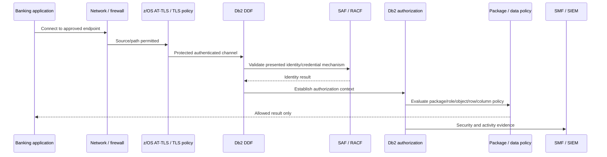
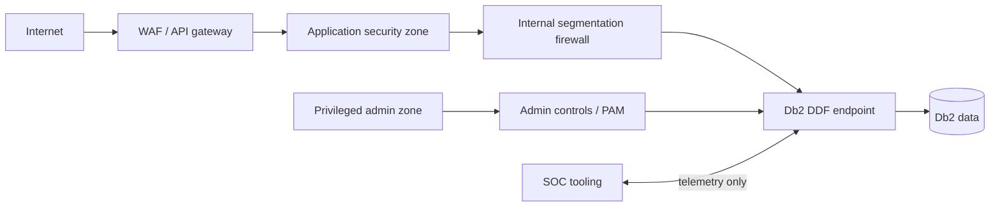

import {CourseProgress, KnowledgeCheck, PracticeChecklist, ScenarioDecision, EvidenceConsole, LessonComplete, LearningLocationTracker} from '@site/src/components/LearningWidgets';

<LearningLocationTracker />

# Module 5: DDF, DRDA, AT-TLS & network security

**Recommended time:** 4 hours

<CourseProgress compact />

Distributed Data Facility (DDF) is the Db2 for z/OS gateway for distributed database access using DRDA. In modern banks, that can mean Java microservices, API platforms, IBM Db2 Connect clients, analytics workloads and integration services. DDF security is therefore a **remote trust problem** involving network path, encryption, authentication, identity mapping, authorization and monitoring.

## 5.1 The distributed trust chain

A secure port is not enough if the application ID is over-privileged. Strong RACF authentication is not enough if credentials travel over an unapproved path. Perfect TLS is not enough if certificate expiry takes the payment channel offline because lifecycle management was ignored.

## 5.2 DDF security inventory

For every production DDF endpoint, record:

- Db2 subsystem/location name;
- DDF listening ports and which are intended to be secure;
- VIPA/DNS/load-balancer dependencies where used;
- permitted source networks/applications;
- TLS/AT-TLS policy and owner;
- server certificate identity and expiry;
- trust anchors/intermediate chain;
- client-authentication requirements, if any;
- accepted Db2 authentication mechanisms;
- RACF/SAF mapping and authorization ID outcome;
- connection profiles/trusted contexts that change policy;
- timeout/rate/connection controls;
- audit/monitoring events and alert owners.

## 5.3 AT-TLS as a z/OS transport-control pattern

Application Transparent TLS (AT-TLS) lets z/OS Communications Server apply TLS protection based on policy rather than requiring each application protocol implementation to own the cryptographic negotiation itself.

For DDF, validate:

1. traffic actually matches the intended policy rule;
2. only approved protocol versions/cipher suites are permitted by current bank standards;
3. the certificate name and trust chain match the deployed endpoint model;
4. private keys are protected using approved key-management facilities;
5. expiry/renewal has monitoring and rehearsed change steps;
6. clients fail securely when protection is required;
7. non-secure listener paths are disabled, restricted or explicitly justified.

## 5.4 Authentication and credential protection

Db2 for z/OS supports multiple distributed authentication patterns depending on release/function level and client capabilities. Security teams should treat authentication choice as an **architecture decision** and record prerequisites.

Review questions:

- Does the connection send a reusable password or use a stronger/tokenised mechanism?
- Is the credential protected in transit and at rest on the client side?
- Are service credentials long-lived?
- Can the same credential connect from unexpected networks?
- Is certificate or token revocation operationally tested?
- Does the authentication result produce the intended Db2 authorization ID?
- Are failed authentication patterns monitored?

Db2 13 has continued to add security capabilities through function levels; for example, newer identity-token support is function-level dependent. Treat the **activated function level and client compatibility** as part of the control evidence.

## 5.5 Network segmentation

A common target architecture separates:

Principles:

- user-facing networks should not connect directly to Db2;
- application source ranges should be explicit;
- privileged administration should use a separately governed path;
- test/non-production paths must not silently reach production;
- telemetry should not require excessive database privilege;
- egress from the Db2/z/OS tier should be justified and monitored.

## 5.6 Certificate lifecycle playbook

A certificate is not “installed and done”.

**90–60 days before expiry**
- alert owner;
- confirm renewal authority and DNS/service names;
- verify dependent clients and trust stores.

**Before change**
- validate new certificate and chain in lower environment;
- confirm rollback material;
- check DDF/AT-TLS policy match;
- schedule change and business validation.

**During change**
- preserve existing service where possible;
- update required keyring/key material using approved process;
- refresh/restart only what the platform/policy requires;
- test from each critical client class.

**After change**
- prove TLS negotiation and server identity;
- prove authentication/authorization still map correctly;
- monitor errors;
- retain change and test evidence;
- remove superseded credentials/keys when safe.

## 5.7 Lab: distributed access control review

<EvidenceConsole commands={['DDF security review', 'RACF identity review', 'SMF audit sample']} />

### Track A

Create a DDF security review report with these headings:

1. endpoint and business services;
2. source-network allow-list;
3. TLS policy;
4. certificate lifecycle;
5. authentication mechanism;
6. service-ID secret/token lifecycle;
7. Db2 authorization ID and role/package mapping;
8. negative tests;
9. monitoring/alerting;
10. outage rollback.

### Track B — authorised environment

Use read-only operational evidence appropriate to your installation. Typical Db2 commands include `-DISPLAY DDF` variations to review DDF state; exact options vary by release and operational standards. Pair this with z/OS Communications Server/AT-TLS policy evidence owned by the network security team.

Perform **non-destructive tests** from an approved client:

- valid client from approved network succeeds;
- invalid credential fails;
- approved identity cannot access an out-of-scope object;
- unapproved source path fails if your lab network permits the test;
- TLS negotiation uses expected protocol/certificate;
- failed attempts appear in the expected security evidence pipeline.

<PracticeChecklist
  id="m5-ddf"
  title="DDF security evidence pack"
  items={[
    'I documented each approved DDF endpoint and its business consumers.',
    'I identified the secure transport policy and certificate/key owner.',
    'I recorded the distributed authentication mechanism and the resulting Db2 authorization context.',
    'I documented permitted source networks and a separate privileged-administration path.',
    'I tested or designed a negative authorization test for an authenticated but out-of-scope identity.',
    'I documented certificate-expiry monitoring, renewal, rollback and post-change validation.',
    'I identified which audit/SMF/SIEM evidence proves failed and successful distributed access.'
  ]}
/>

<ScenarioDecision
  title="TLS certificate emergency"
  prompt="The DDF certificate will expire tonight and the mobile-banking tier depends on it. An operator proposes disabling TLS until the certificate can be replaced next week."
  options={[
    {label: 'Disable TLS because availability is the highest priority.', correct: false, feedback: 'This turns an operational lifecycle failure into a confidentiality/authentication failure and may violate policy or regulatory commitments.'},
    {label: 'Execute the approved emergency certificate-renewal/change path with dependent-client validation, rollback and heightened monitoring.', correct: true, feedback: 'Treat certificate renewal as a controlled availability-and-security change rather than weakening the transport boundary.'},
    {label: 'Open an additional unencrypted DDF port only for the application subnet.', correct: false, feedback: 'Source restriction is not a substitute for the required transport protection and credential-security design.'}
  ]}
/>

<KnowledgeCheck
  id="m5-kc1"
  question="Which statement best describes DDF security?"
  options={[
    'It is only a firewall configuration problem.',
    'It is a layered remote-trust problem spanning path, TLS, authentication, authorization, application privilege and evidence.',
    'It is solved once a password is configured.',
    'It is unrelated to RACF.'
  ]}
  correctIndex={1}
  explanation="A remote Db2 connection crosses multiple trust boundaries, and each layer must support the same least-privilege and accountability objective."
/>

<KnowledgeCheck
  id="m5-kc2"
  question="Why is certificate expiry a security concern as well as an availability concern?"
  options={[
    'Because expired certificates increase index size.',
    'Because rushed expiry remediation can lead teams to bypass TLS or trust validation, while an outage can affect critical banking services.',
    'Because RACF groups expire with the certificate.',
    'Because SMF stops recording when a certificate expires.'
  ]}
  correctIndex={1}
  explanation="Certificate lifecycle failures pressure operators to weaken controls; mature designs rehearse renewal and rollback before that emergency occurs."
/>

## Primary references

- IBM Db2 for z/OS: Distributed data facility: https://www.ibm.com/docs/en/db2-for-zos/13.0.0?topic=environment-distributed-data-facility
- IBM Db2 for z/OS security: https://www.ibm.com/docs/en/db2-for-zos/13.0.0?topic=security
- IBM z/OS Communications Server AT-TLS: https://www.ibm.com/docs/en/zos/3.1.0?topic=tls-application-transparent-at
- IBM Db2 13 function levels: https://www.ibm.com/docs/en/db2-for-zos/13.0.0?topic=levels-db2-13-function

<LessonComplete lessonId="m5" nextHref="/course/module-6-trusted-context-rcac" nextLabel="Start Module 6" />
