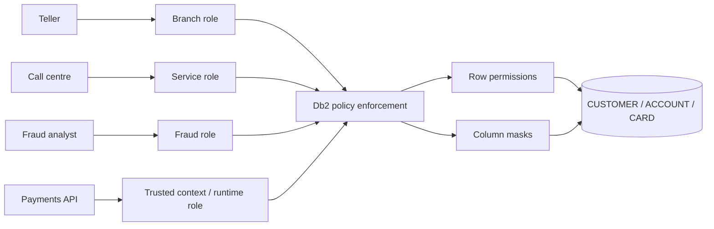
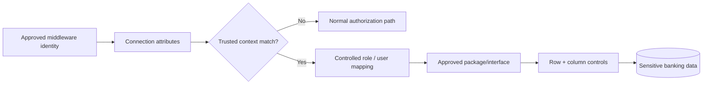

import {CourseProgress, KnowledgeCheck, PracticeChecklist, ScenarioDecision, LessonComplete, LearningLocationTracker} from '@site/src/components/LearningWidgets';

<LearningLocationTracker />

# Module 6: Trusted contexts, roles, row permissions & column masks

**Recommended time:** 4 hours

<CourseProgress compact />

Network and identity controls answer **who may reach Db2**. Fine-grained Db2 controls answer **which rows and which representation of sensitive values the authorised context should see**.

## 6.1 Move policy closer to the data

Suppose a bank has one customer table used by tellers, fraud analysts, call-centre staff and back-office systems.



Application code can still implement business authorization, but enforcing important data restrictions in Db2 creates an additional boundary that is harder to bypass accidentally through a new query path.

## 6.2 Row permissions

Row permissions determine whether a row is available to an applicable authorization context.

Banking use cases:

- teller may access only customers assigned to the teller's branch/region;
- collections user may see only accounts assigned to their work queue;
- fraud analyst may see cases assigned to the fraud domain;
- tenant/business-unit separation in shared operational databases;
- privileged investigations may require a separate role and logged approval path.

Conceptual pattern:

```sql
CREATE PERMISSION BRANCH_CUSTOMER_ACCESS
  ON BANK.CUSTOMER
  FOR ROWS WHERE BRANCH_ID = /* authorised branch context */
  ENFORCED FOR ALL ACCESS
  ENABLE;

ALTER TABLE BANK.CUSTOMER ACTIVATE ROW ACCESS CONTROL;
```

The exact expression must be designed around reliable context. Never base a high-value permission on untrusted client-supplied text simply because it is convenient.

## 6.3 Column masks

Column masks determine the value/representation of a column returned to a context.

Examples:

- call-centre agent sees `************4567` instead of full PAN;
- general support role sees redacted national ID;
- fraud role sees more detail only when the role/context permits it;
- analytics role receives a transformed or tokenised representation.

Conceptual pattern:

```sql
CREATE MASK PAN_MASK
  ON BANK.CARD
  FOR COLUMN PAN RETURN
    CASE
      WHEN /* approved privileged context */ THEN PAN
      ELSE '************' CONCAT RIGHT(PAN, 4)
    END
  ENABLE;

ALTER TABLE BANK.CARD ACTIVATE COLUMN ACCESS CONTROL;
```

The course examples illustrate the design pattern. Validate exact syntax, data types, functions and context expressions against the current Db2 documentation and your lab schema.

## 6.4 Trusted contexts

Trusted contexts are useful when a multi-tier application connects under known attributes and needs a controlled role/authorization treatment.

A trusted-context design should answer:

- Which **system authorization ID** establishes the connection?
- Which connection attributes are trusted (for example address characteristics supported by the function level)?
- Which role becomes active by default or for which users?
- Can the connection switch user/role, and under what rules?
- Does the design work for local and/or remote connections as intended?
- What happens if the workload connects from a different source?
- How is the use of the trusted context audited?



Db2 13 has received trusted-context enhancements through maintenance/function levels, including expanded address/subnet handling and improvements to trusted-context usage. Record the actual maintenance prerequisites in your design.

## 6.5 Do not use RCAC to hide bad privilege design

Bad pattern:

> Give the service account broad table access, then depend on one column mask to make everything safe.

Better pattern:

1. narrow connection/source;
2. authenticate workload;
3. use narrow role/package/object privileges;
4. apply row and column restrictions;
5. monitor activity;
6. test both permitted and forbidden cases.

Fine-grained controls are **additional constraints**, not an excuse for broad base authority.

## 6.6 Policy test matrix

For every row permission or mask, create a table like this:

| Persona/context | Expected rows | Expected sensitive columns | Direct base-table access? | Test result |
|---|---|---|---|---|
| Teller JHB | JHB branch only | masked PAN / ID | no | |
| Teller CPT | Cape Town branch only | masked PAN / ID | no | |
| Call centre | assigned customers | masked PAN | no | |
| Fraud investigator | approved cases | full PAN only if business need is approved | controlled | |
| System DBA | no business-data requirement | no sensitive data by default | no | |
| Break-glass investigator | approved scope/time | approved values | time-bound | |

## 6.7 Lab: design and test a row/column security policy

### Scenario

`BANK.CUSTOMER_ACCOUNT` contains:

- `CUSTOMER_ID`
- `BRANCH_ID`
- `ACCOUNT_NO`
- `ID_NUMBER`
- `CARD_PAN`
- `BALANCE`
- `RISK_RATING`

Design controls for four personas:

1. branch teller;
2. call-centre agent;
3. fraud investigator;
4. production system DBA.

### Required design outputs

- role map;
- row predicate logic;
- column-mask logic;
- package/view/direct-access decision;
- trusted-context decision for middleware;
- positive tests;
- negative tests;
- audit evidence expected for each context.

### Example negative tests

```text
Teller_JHB queries CUSTOMER_ID assigned to CPT -> zero rows / denied by policy
CallCentre queries CARD_PAN -> masked representation
SystemDBA attempts SELECT * from customer table -> denied under normal role
Payments service connects from unapproved source -> trusted-context rule does not activate
```

<PracticeChecklist
  id="m6-fine-access"
  title="Fine-grained access evidence"
  items={[
    'I documented the business rule before writing the row permission or column mask.',
    'I used a trustworthy authorization/context source rather than untrusted client input.',
    'I separated package/object privilege from row/column policy.',
    'I wrote positive and negative test cases for each persona.',
    'I documented trusted-context attributes, role activation and failure behaviour.',
    'I identified how SECADM changes to these policies are audited and reviewed.'
  ]}
/>

<ScenarioDecision
  title="The support DBA needs visibility"
  prompt="A support team argues that SYSADM users should always see unmasked customer data because they might need it during an incident. What is the best target-state principle?"
  options={[
    {label: 'Permanent unmasked access for every administrator.', correct: false, feedback: 'This makes rare incident needs a permanent confidentiality exposure.'},
    {label: 'Normal administration should remain data-minimised; sensitive break-glass access should be explicit, attributable, time-bound and audited.', correct: true, feedback: 'The control preserves operational capability while keeping sensitive access exceptional and reviewable.'},
    {label: 'Remove all administrative access to Db2.', correct: false, feedback: 'The system still requires controlled administration; the objective is separation and evidence, not operational paralysis.'}
  ]}
/>

<KnowledgeCheck
  id="m6-kc1"
  question="What is the key difference between a row permission and a column mask?"
  options={[
    'A row permission restricts which rows qualify; a column mask controls the value/representation returned for a column.',
    'A row permission encrypts backups; a column mask changes RACF groups.',
    'They are identical features.',
    'Column masks only apply to indexes.'
  ]}
  correctIndex={0}
  explanation="Use row permissions for row visibility and column masks for context-dependent column presentation, while still maintaining least privilege at the role/object level."
/>

<KnowledgeCheck
  id="m6-kc2"
  question="What is a trusted context primarily designed to do?"
  options={[
    'Provide a controlled authorization/role context for connections that match defined trusted characteristics.',
    'Replace transaction logging.',
    'Compress Db2 tables.',
    'Create encryption keys.'
  ]}
  correctIndex={0}
  explanation="Trusted contexts let Db2 attach controlled authorization behaviour to known connection characteristics; they should be narrow, testable and auditable."
/>

## Primary references

- IBM: CREATE PERMISSION statement: https://www.ibm.com/docs/en/db2-for-zos/13.0.0?topic=statements-create-permission
- IBM: Column masks: https://www.ibm.com/docs/en/db2-for-zos/13.0.0?topic=control-column-masks
- IBM: Trusted contexts and roles: https://www.ibm.com/docs/en/db2-for-zos/13.0.0?topic=roles-trusted-context
- IBM: SECADM authority: https://www.ibm.com/docs/en/db2-for-zos/13.0.0?topic=privileges-secadm-authority

<LessonComplete lessonId="m6" nextHref="/course/module-7-cryptography-key-management" nextLabel="Start Module 7" />
