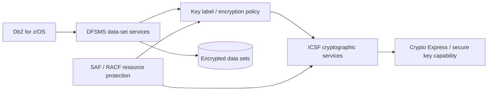
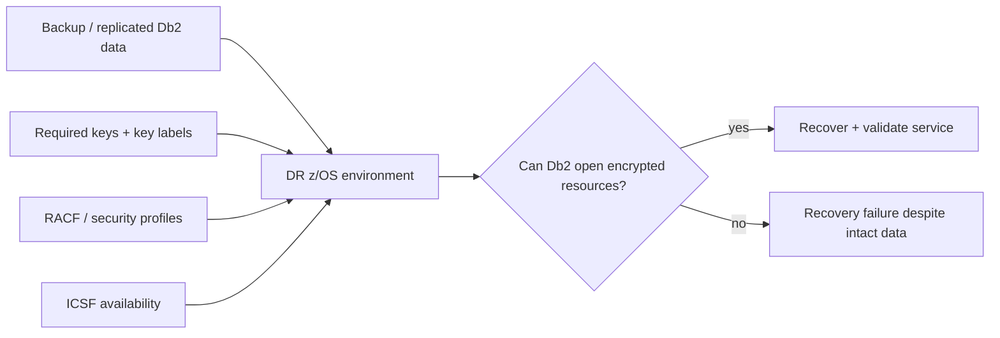

import {CourseProgress, KnowledgeCheck, PracticeChecklist, ScenarioDecision, LessonComplete, LearningLocationTracker} from '@site/src/components/LearningWidgets';

<LearningLocationTracker />

# Module 7: DFSMS encryption, ICSF, keys, HSM & recovery

**Recommended time:** 4 hours

<CourseProgress compact />

Saying “the database is encrypted” is not a complete security statement. A banking cryptography design must specify **what is encrypted, where encryption is enforced, which keys protect it, who can use those keys, how keys rotate, and how the bank recovers encrypted data during a disaster**.

## 7.1 Three different protection problems

  
<strong>Data in transit</strong>
Protect DDF and other network paths with approved TLS policy, server/client trust and credential protection.

  
<strong>Data at rest</strong>
Protect Db2-related z/OS data sets using approved DFSMS data-set encryption and key-management policy where applicable.

  
<strong>Field/application protection</strong>
For particularly sensitive values, evaluate tokenisation, application cryptography or other controls driven by business/regulatory requirements.

One control does not replace the others. TLS does not protect a stolen backup. Data-set encryption does not prevent an authorised-but-overprivileged SQL user from reading plaintext through Db2.

## 7.2 DFSMS data-set encryption and ICSF

At a high level:

**DFSMS** can provide transparent data-set encryption. **ICSF** provides cryptographic services and key-management integration. z/OS security controls determine which identities can use protected cryptographic resources/key labels. Hardware cryptographic facilities can provide secure cryptographic processing and key protection according to the bank's architecture.

The DBA therefore shares responsibility with storage, z/OS security, cryptography/HSM and disaster-recovery teams.

## 7.3 Key-management lifecycle

A complete lifecycle covers:

1. **Generation** — approved algorithms, key types and trusted generation process.
2. **Registration/labeling** — controlled key identifiers and naming standards.
3. **Distribution/availability** — only systems that need the key can use it.
4. **Access control** — identities and groups are restricted through SAF/RACF policy.
5. **Use monitoring** — unusual key use is observable.
6. **Rotation** — planned before expiry/cryptoperiod or policy change.
7. **Backup/recovery** — key material/metadata and services can be recovered without exposing the key.
8. **Revocation** — compromised keys can be disabled and affected data/workloads migrated.
9. **Destruction** — retired keys are disposed of according to retention/recovery obligations.

## 7.4 Separation of duties for cryptography

Avoid a model where one person can:

- create/activate a key;
- grant themselves access to the key;
- alter Db2 data;
- delete the evidence;
- certify the control.

A typical split may involve:

| Function | Owner |
|---|---|
| Data classification / encryption requirement | Data owner + security architecture |
| DFSMS policy | Storage/platform engineering |
| ICSF/key service administration | Cryptographic/key-management team |
| RACF key/resource authorization | z/OS security team |
| Db2 dataset/application mapping | Db2 DBA |
| Independent evidence review | SOC/audit/risk |

## 7.5 Disaster recovery: data without keys is not recovery

A DR plan must prove both sides of the dependency:

DR test evidence should include:

- encrypted data is present;
- expected keys/key labels are available through approved recovery mechanisms;
- RACF profiles permit only intended recovery identities;
- ICSF is operational;
- Db2 starts/recovers and accesses the protected data;
- application validation proves business service restoration;
- no emergency “temporary” key bypass remains after the exercise.

## 7.6 Key compromise playbook

**Trigger examples**
- suspected unauthorized key use;
- leaked key metadata or credentials used to access key services;
- cryptographic-admin account compromise;
- policy/certificate/key-expiry emergency;
- external intelligence indicates a key-management weakness.

**Immediate objectives**
1. preserve evidence;
2. determine affected key labels/data/workloads;
3. restrict attacker access without destroying recovery options;
4. invoke cryptographic incident owner;
5. assess whether rotation/re-encryption is required;
6. protect payment/customer-service continuity;
7. validate DR consequences before key destruction;
8. complete post-incident access and audit review.

:::danger Never improvise key destruction
Destroying or revoking a key before understanding all encrypted dependencies can convert a security incident into unrecoverable data loss. Follow the bank's cryptographic incident and records-retention procedures.
:::

## 7.7 Lab: crypto dependency and recovery map

Create a dependency graph for one critical database. Include:

- Db2 subsystem;
- critical data sets;
- DFSMS encryption policy;
- key labels;
- ICSF services;
- RACF profiles/groups;
- primary site;
- DR site;
- backups/copies;
- key backup/recovery mechanism;
- owners;
- last successful recovery test.

Then run a tabletop with this inject:

> The DR system receives the latest replicated Db2 data after a regional outage, but the Db2 startup/recovery process cannot access one encrypted data set because the expected key is unavailable.

Write the first 10 actions. Your response must include evidence preservation, key-service ownership, RACF authorization verification, business-service prioritisation and a decision point before any destructive key change.

<PracticeChecklist
  id="m7-crypto"
  title="Cryptography and recovery evidence"
  items={[
    'I separated in-transit, at-rest and field/application cryptographic requirements.',
    'I mapped the encrypted Db2 resources to DFSMS policy and key labels.',
    'I identified ICSF/key-service and RACF authorization owners.',
    'I documented key generation, use, rotation, revocation and destruction governance.',
    'I proved or designed a DR test that validates both encrypted data and key/security-service availability.',
    'I documented the incident decision point that prevents premature key destruction.'
  ]}
/>

<ScenarioDecision
  title="The DR copy is healthy"
  prompt="Storage replication reports 100% success, so management declares the encrypted Db2 service recoverable. What is the strongest response?"
  options={[
    {label: 'Accept storage replication as proof of recoverability.', correct: false, feedback: 'Encrypted bytes alone do not prove the DR environment has the required keys, security profiles, ICSF services or application-level recovery path.'},
    {label: 'Require a recovery test that validates data, key availability, authorization, ICSF and business-service functionality.', correct: true, feedback: 'Recoverability is an end-to-end capability, not a storage-copy metric.'},
    {label: 'Disable encryption at DR to simplify recovery.', correct: false, feedback: 'Weakening the recovery site can create a major confidentiality and compliance gap.'}
  ]}
/>

<KnowledgeCheck
  id="m7-kc1"
  question="Why does data-set encryption not replace Db2 least privilege?"
  options={[
    'Because encryption only protects data while Db2 is stopped.',
    'Because an identity legitimately authorised through Db2 can receive decrypted data; encryption at rest does not decide SQL-level business authorization.',
    'Because encryption removes audit logging.',
    'Because RACF cannot protect cryptographic resources.'
  ]}
  correctIndex={1}
  explanation="At-rest encryption primarily protects stored data from unauthorized access to the underlying media/data set; Db2 authorization still governs legitimate database access paths."
/>

<KnowledgeCheck
  id="m7-kc2"
  question="What must a DR test prove for encrypted Db2 data?"
  options={[
    'Only that the copied data set exists.',
    'That the data, required keys/key labels, ICSF services, security profiles and Db2/application recovery path all function under controlled authorization.',
    'That the production key can be emailed to the DR operator.',
    'Only that the backup command returned RC=0.'
  ]}
  correctIndex={1}
  explanation="The recovery dependency includes cryptographic and authorization services as well as the encrypted data itself."
/>

## Primary references

- IBM Db2 for z/OS: Encrypting data with z/OS DFSMS data-set encryption: https://www.ibm.com/docs/en/db2-for-zos/13.0.0?topic=pdter-encrypting-your-data-zos-dfsms-data-set-encryption
- IBM ICSF documentation: https://www.ibm.com/docs/en/zos/3.1.0?topic=zos-integrated-cryptographic-service-facility
- IBM z/OS Security Server RACF: https://www.ibm.com/docs/en/zos/3.1.0?topic=server-security-racf

<LessonComplete lessonId="m7" nextHref="/course/module-8-audit-smf-monitoring" nextLabel="Start Module 8" />
