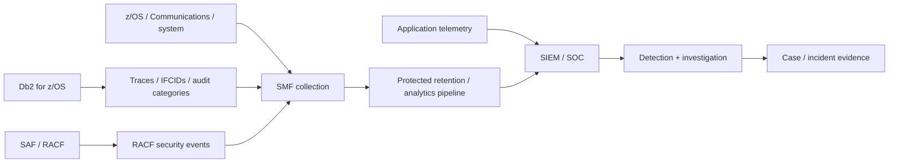

import {CourseProgress, KnowledgeCheck, PracticeChecklist, ScenarioDecision, EvidenceConsole, LessonComplete, LearningLocationTracker} from '@site/src/components/LearningWidgets';

<LearningLocationTracker />

# Module 8: Db2 audit, IFCIDs, SMF, RACF evidence & SIEM

**Recommended time:** 4 hours

<CourseProgress compact />

In a bank, a control that cannot be evidenced is difficult to operate, investigate or defend. Db2 and z/OS generate rich security and operational telemetry, but the security outcome depends on whether the organisation **collects the right events, protects them, correlates identity, alerts on meaningful conditions and can retrieve evidence during an incident or audit**.

## 8.1 Evidence pipeline

The design should support a timeline that crosses application, network, identity and Db2 activity.

## 8.2 What should be auditable?

At minimum, consider these security event classes:

### Identity and access
- successful and failed authentication where relevant;
- changes to RACF users/groups/resources supporting Db2;
- use of powerful or emergency identities;
- role/trusted-context activation evidence where required.

### Authorization and policy
- GRANT/REVOKE and administrative privilege changes;
- role changes;
- trusted-context changes;
- row-permission/column-mask changes;
- audit-policy changes;
- security-relevant subsystem configuration changes.

### Sensitive data access
- access to high-risk tables/views or operations where policy requires it;
- unusual volume, time, source or privileged-user access;
- export/extraction patterns;
- break-glass queries.

### Administrative activity
- utilities and operational actions with security impact;
- bind/rebind/deployment events;
- system commands and privileged administration;
- audit/trace start/stop changes.

### Cryptography and recovery
- protected resource/key access evidence from the relevant platform controls;
- backup/recovery actions affecting sensitive data;
- DR test evidence.

## 8.3 Db2 audit policies

Db2 for z/OS provides audit-policy capability so organisations can define which categories of activity should be captured for specified objects/users/contexts according to the supported policy model.

A bank should govern audit policies like security code:

- named owner;
- documented objective;
- scope and affected objects;
- event categories;
- expected SMF volume;
- retention and access controls;
- detection rule mapping;
- change control;
- periodic test that the expected event is actually captured.

Avoid two extremes:

1. **under-logging** — the decisive event is absent;
2. **collect-everything without engineering** — high cost and noise make important events effectively invisible.

## 8.4 IFCIDs and SMF

Instrumentation Facility Component Identifiers (IFCIDs) identify categories of Db2 trace data. Db2 trace records can be written to destinations including SMF. Security practitioners do not need to memorise every IFCID; they need to understand how to determine which trace/audit event supports a control objective and how the bank's monitoring tooling consumes it.

Evidence worksheet:

| Control objective | Db2/RACF evidence | Analytics rule | Retention | Owner |
|---|---|---|---|---|
| Detect privileged SELECT on card data | Db2 audit/trace + auth ID/context | privileged actor + sensitive object + unusual time | bank policy | SOC |
| Detect security grant outside change window | privilege-change audit + change calendar | grant/revoke without approved ticket | bank policy | Security Ops |
| Detect repeated DDF auth failure | RACF/Db2/network evidence | threshold + source + account | bank policy | SOC/IAM |
| Prove package change | bind/rebind evidence + release record | compare release ID/package timestamp | release retention | DBA/DevSecOps |

## 8.5 Time synchronisation and correlation

An investigation may combine:

- application logs;
- API gateway events;
- firewall flow;
- AT-TLS/TCP evidence;
- RACF events;
- Db2 audit/trace;
- PAM session logs;
- change-management records.

If clocks or timezone interpretation do not align, the timeline becomes unreliable. Time integrity is therefore part of the logging control.

## 8.6 Privileged access monitoring

High-value detections include:

- SYSADM/SECADM activity outside normal windows;
- a normally administrative identity executing sensitive data SQL;
- changes to row permissions/column masks followed by bulk reads;
- a service account accessing a new object or collection;
- new privilege grant followed rapidly by use;
- audit trace/policy reduction before sensitive activity;
- DDF source/location change for an established service ID;
- break-glass account use without an active incident/change record.

Do not alert merely because an administrator exists. Alert when activity conflicts with the **expected administrative behaviour and business context**.

## 8.7 Evidence handling principles

- restrict who can alter/delete raw evidence;
- separate evidence administration from the actors being monitored where feasible;
- document retention by legal/regulatory/business requirement;
- maintain chain-of-custody practices for incident evidence;
- preserve raw timestamps and source identifiers;
- avoid exporting unnecessary live customer data into a SIEM;
- test retrieval, not only ingestion;
- document gaps and compensating controls.

## 8.8 Lab: reconstruct a privileged-access event

<EvidenceConsole commands={['SMF audit sample', 'RACF identity review', 'Db2 privilege review', 'DDF security review']} />

### Incident brief

At `10:14:12`, a privileged database identity performs an administrative operation against `BANK.CUSTOMER`. Six seconds later, the payment application performs a normal read. At `10:15:01`, a security administrator changes an application role.

Build a timeline and answer:

1. Which event is most suspicious and why?
2. Which evidence source would identify the human/session behind the DBA identity?
3. Which PAM/change ticket should exist?
4. Could the later role change be remediation, attacker persistence or an unrelated approved change?
5. Which raw records must be preserved before interviewing users?
6. What additional context is required from application/network teams?
7. What would constitute sufficient evidence to close the investigation as legitimate activity?

<PracticeChecklist
  id="m8-audit"
  title="Audit and detection evidence pack"
  items={[
    'I mapped at least 10 security control objectives to concrete evidence sources.',
    'I identified which Db2 audit/trace events and RACF/SMF data are required for privileged-access investigations.',
    'I documented time synchronisation/timezone handling across sources.',
    'I created at least five high-value detection rules for privileged or service-account activity.',
    'I documented raw-evidence retention and who is allowed to alter/delete it.',
    'I successfully reconstructed a synthetic incident timeline using at least three evidence sources.'
  ]}
/>

<ScenarioDecision
  title="The audit trace is too noisy"
  prompt="Operations proposes disabling a security-relevant audit category because SMF volume increased significantly. What is the best next step?"
  options={[
    {label: 'Disable it immediately to protect storage.', correct: false, feedback: 'Removing evidence can create a control gap before the impact and regulatory need are understood.'},
    {label: 'Quantify volume and control objective, tune scope/collection/retention where supported, validate detections, and obtain security/risk approval before reducing evidence.', correct: true, feedback: 'Audit engineering should balance required evidence and operational cost without silently removing the control.'},
    {label: 'Send all Db2 table contents to the SIEM instead.', correct: false, feedback: 'That creates data-minimisation and confidentiality problems and still may not provide the right security event semantics.'}
  ]}
/>

<KnowledgeCheck
  id="m8-kc1"
  question="What makes a security log operationally useful?"
  options={[
    'Large volume alone.',
    'Attributable identity/context, protected retention, reliable time, a defined control objective and tested retrieval/alerting.',
    'Keeping it only on the monitored administrator’s workstation.',
    'Recording only successful events.'
  ]}
  correctIndex={1}
  explanation="Logs become security evidence when they can reliably answer a control or incident question and are protected from the actors they monitor."
/>

<KnowledgeCheck
  id="m8-kc2"
  question="Why should Db2 audit evidence be correlated with RACF and application/PAM evidence?"
  options={[
    'Db2 never records authorization IDs.',
    'Cross-source correlation ties database activity to authentication, business/application context and the privileged human/session behind it.',
    'RACF replaces Db2 audit.',
    'PAM logs are only used for performance tuning.'
  ]}
  correctIndex={1}
  explanation="A defensible incident timeline normally crosses several trust boundaries; no single source carries all of the identity and business context."
/>

## Primary references

- IBM Db2 for z/OS audit policies: https://www.ibm.com/docs/en/db2-for-zos/13.0.0?topic=security-audit-policies
- IBM Db2 for z/OS traces and IFCIDs: https://www.ibm.com/docs/en/db2-for-zos/13.0.0?topic=monitoring-db2-traces
- IBM z/OS System Management Facilities (SMF): https://www.ibm.com/docs/en/zos/3.1.0?topic=zos-system-management-facilities-smf
- OWASP Logging Cheat Sheet: https://cheatsheetseries.owasp.org/cheatsheets/Logging_Cheat_Sheet.html

<LessonComplete lessonId="m8" nextHref="/course/module-9-owasp-application-security" nextLabel="Start Module 9" />
