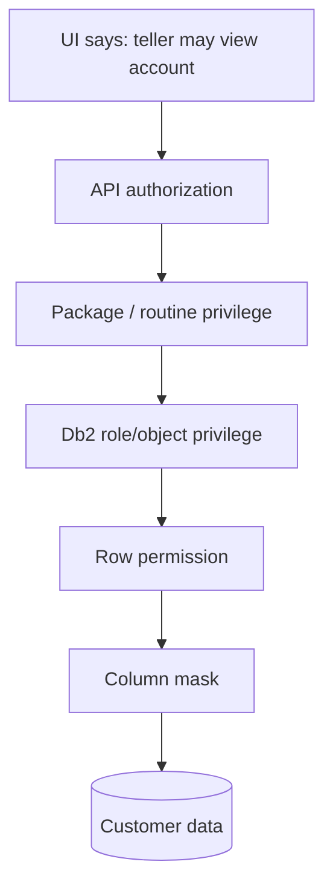

import {CourseProgress, KnowledgeCheck, PracticeChecklist, ScenarioDecision, LessonComplete, LearningLocationTracker} from '@site/src/components/LearningWidgets';

<LearningLocationTracker />

# Module 9: OWASP-informed secure application engineering

**Recommended time:** 4 hours

<CourseProgress compact />

OWASP guidance is not a substitute for RACF, Db2 authorization, PCI DSS or banking regulation. It is useful because many attacks reach Db2 **through application design mistakes**: unsafe SQL construction, broken access control, overprivileged service identities, weak secret handling, insufficient logging or insecure exception behaviour.

## 9.1 OWASP Top 10:2025 — relevance to the Db2 boundary

| OWASP Top 10:2025 category | Db2/banking security question |
|---|---|
| A01 Broken Access Control | Can the application call a package/query or retrieve rows/columns outside the user's business role? |
| A02 Security Misconfiguration | Are DDF, TLS, service IDs, packages, default privileges and error behaviour securely configured? |
| A03 Software Supply Chain Failures | Can a compromised dependency/build pipeline alter SQL, packages or deployment artefacts? |
| A04 Cryptographic Failures | Are credentials, network paths, sensitive data and keys protected appropriately? |
| A05 Injection | Does user-controlled input change SQL structure instead of remaining data? |
| A06 Insecure Design | Is authorization enforced by design, or bolted on as scattered UI checks? |
| A07 Authentication Failures | Can users/workloads impersonate valid identities or reuse long-lived secrets? |
| A08 Software or Data Integrity Failures | Are packages, deployment artefacts and critical data changes integrity-protected? |
| A09 Security Logging & Alerting Failures | Can the bank detect and reconstruct malicious or privileged database activity? |
| A10 Mishandling of Exceptional Conditions | Does failure expose sensitive data, bypass controls or leave inconsistent privilege/security state? |

## 9.2 SQL injection

Unsafe pattern:

```text
sql = "SELECT * FROM BANK.CUSTOMER WHERE CUSTOMER_ID='" + input + "'"
```

The application mixes **SQL structure** and **untrusted data**.

Preferred pattern conceptually:

```sql
SELECT CUSTOMER_ID, NAME, STATUS
FROM BANK.CUSTOMER_VIEW
WHERE CUSTOMER_ID = ?
```

Use prepared/parameterized statements so request values are treated as data. Combine this with:

- allow-list validation for fields with constrained formats;
- narrow SELECT lists;
- package/view interfaces where appropriate;
- least-privilege service identity;
- row/column controls for sensitive data;
- safe error handling;
- security logging of suspicious input/authorization failures.

Escaping alone should not be the primary injection defence when parameterization is available.

## 9.3 Stored procedures and packages are not automatically safe

A stored procedure or static package can still be insecure if it:

- constructs dynamic SQL from unchecked input;
- runs with excessive authority;
- exposes a general-purpose query interface;
- trusts client-supplied role/branch identifiers;
- returns excessive sensitive data;
- leaks implementation details in errors;
- lacks audit context.

The security property comes from the **design and privilege model**, not the artefact type.

## 9.4 Broken access control at multiple layers



The UI is not the security boundary. If an attacker calls the API directly, downstream controls should still prevent out-of-scope access.

## 9.5 Non-human identities (NHI)

Service accounts, automation identities and integration credentials deserve their own lifecycle. Risks include:

- no clear owner;
- overprivileged identity;
- long-lived secret;
- credential embedded in source or scripts;
- secret copied to multiple environments;
- no source/network binding;
- weak rotation;
- no offboarding;
- monitoring assumes “service account activity is normal”.

### Minimum NHI record

```text
Identity: PAYAPI01
Owner: Payments Platform
Purpose: Execute payment-authorisation package
Allowed source: application zone / approved workload
Credential/token mechanism: approved enterprise mechanism
Rotation: defined + tested
Db2 role/package privilege: documented minimum
Forbidden access: direct sensitive base tables / grant authority
Monitoring: source, time, object, volume anomalies
Offboarding trigger: service retirement / replacement
```

## 9.6 Secrets

Never treat Base64, source-code obfuscation or a protected spreadsheet as a secrets-management strategy.

A banking secret lifecycle should address:

- creation through an approved system;
- minimal audience;
- environment separation;
- automated delivery where practical;
- no accidental exposure to code repositories/logs/tickets;
- rotation and revocation;
- monitoring;
- emergency compromise procedure.

## 9.7 Error handling

Applications should fail **securely and observably**.

Bad outcomes:

- database error returned to the customer with schema/object names;
- exception handler retries an operation using a more privileged connection;
- authentication failure falls back to a shared account;
- transaction exception leaves business state ambiguous;
- security logging crashes and the application silently continues with no evidence.

A good design separates:

- safe user-facing message;
- detailed internal correlation ID;
- protected diagnostic context;
- rollback/transaction behaviour;
- security alert path when the exception is suspicious.

## 9.8 OWASP tips translated into Db2 controls

<div className="control-grid">
  <div className="control-card"><strong>Parameterize SQL</strong><p>Keep input as data, not executable SQL structure.</p></div>
  <div className="control-card"><strong>Least privilege</strong><p>Give the runtime only approved package/object access and restrict rows/columns.</p></div>
  <div className="control-card"><strong>Protect NHI secrets</strong><p>Use managed credential/token lifecycles, not code or configuration sprawl.</p></div>
  <div className="control-card"><strong>Log security events</strong><p>Correlate application identity and request IDs with Db2/RACF/SMF evidence.</p></div>
  <div className="control-card"><strong>Fail closed where appropriate</strong><p>Do not bypass authorization or TLS when dependencies fail.</p></div>
  <div className="control-card"><strong>Review the supply chain</strong><p>Treat package bind/deployment, dependencies and generated SQL as production code.</p></div>
</div>

## 9.9 Lab: attack-path code review

Review this fictional endpoint:

```text
GET /api/customer?branch=JHB&customer=12345

1. App authenticates user.
2. App trusts branch=JHB from the request.
3. App concatenates customer into a SQL string.
4. Service ID has SELECT on all CUSTOMER and CARD tables.
5. Response returns every column.
6. Errors include SQLCODE and table name.
7. Service credential is stored in application.properties.
8. Audit records only HTTP 200/500, not user/customer/object context.
```

Identify at least **12 controls or design changes**. Your answer must include:

- server-side business authorization;
- parameterized SQL;
- least privilege/package or view interface;
- row permission/column mask decision;
- data minimisation;
- secrets management;
- error handling;
- logging/correlation;
- negative tests;
- monitoring for service-ID anomaly.

### Secure pseudo-code target

```text
actor = authenticatedIdentity()
branch = authorisedBranchFor(actor)
customerId = validateCustomerId(request.customer)

result = preparedQuery(
  "SELECT CUSTOMER_ID, DISPLAY_NAME, STATUS, MASKED_PAN FROM BANK.CUSTOMER_API_V WHERE CUSTOMER_ID = ?",
  customerId
)

if not result.allowedFor(actor, branch): deny + securityLog()
return minimalResponse(result, correlationId)
```

The example is intentionally language-neutral. Use your approved framework's parameterization and identity APIs.

<PracticeChecklist
  id="m9-owasp"
  title="OWASP-to-Db2 secure engineering evidence"
  items={[
    'I found and removed SQL string-concatenation risk in the fictional endpoint.',
    'I separated client input from authoritative server-side business authorization context.',
    'I reduced the service account to the minimum package/object/data access needed.',
    'I documented an approved secret/token storage and rotation mechanism.',
    'I reduced returned columns to business need and defined row/column policy.',
    'I designed safe user errors plus detailed protected internal correlation.',
    'I mapped application request identity/correlation to Db2/RACF/SMF evidence.',
    'I wrote abuse-case tests for injection and broken access control.'
  ]}
/>

<ScenarioDecision
  title="Prepared statements are in place"
  prompt="A team says SQL injection is now solved and requests broad SELECT on all banking tables for the API service account."
  options={[
    {label: 'Approve because parameterization makes the database safe.', correct: false, feedback: 'Parameterization addresses injection structure, not broken access control, credential compromise or excessive data exposure.'},
    {label: 'Keep parameterization and still enforce least privilege, data minimisation, row/column policy and service-account monitoring.', correct: true, feedback: 'Controls should overlap so compromise of one application layer does not expose the entire data estate.'},
    {label: 'Remove parameterization and rely on RACF instead.', correct: false, feedback: 'Identity authorization does not prevent an authorised application from executing attacker-controlled SQL if the application constructs it unsafely.'}
  ]}
/>

<KnowledgeCheck
  id="m9-kc1"
  question="What is OWASP's preferred primary control against SQL injection when supported by the technology?"
  options={[
    'Prepared/parameterized statements.',
    'Escaping every input by hand.',
    'Granting SYSADM to the application.',
    'Hiding SQL errors from the DBA.'
  ]}
  correctIndex={0}
  explanation="Parameterization separates SQL structure from data. It should be combined with least privilege and input validation, not used as the only security control."
/>

<KnowledgeCheck
  id="m9-kc2"
  question="Why is a non-human service identity a high-value security object?"
  options={[
    'Because service accounts never expire.',
    'Because it can hold persistent machine-to-machine privilege and may operate continuously without interactive human scrutiny.',
    'Because it cannot be audited.',
    'Because it is always more secure than a human identity.'
  ]}
  correctIndex={1}
  explanation="NHI lifecycle, secret handling, privilege, ownership and monitoring must be explicit because these identities often sit on critical automated paths."
/>

## Primary references

- OWASP Top 10:2025: https://owasp.org/Top10/2025/
- OWASP SQL Injection Prevention Cheat Sheet: https://cheatsheetseries.owasp.org/cheatsheets/SQL_Injection_Prevention_Cheat_Sheet.html
- OWASP Database Security Cheat Sheet: https://cheatsheetseries.owasp.org/cheatsheets/Database_Security_Cheat_Sheet.html
- OWASP Logging Cheat Sheet: https://cheatsheetseries.owasp.org/cheatsheets/Logging_Cheat_Sheet.html
- OWASP Non-Human Identities Top 10: https://owasp.org/www-project-non-human-identities-top-10/

<LessonComplete lessonId="m9" nextHref="/course/module-10-compliance-regulatory" nextLabel="Start Module 10" />
