# ZBSEC1 Banking Security Playbook Library

These playbooks are **decision frameworks**, not production commands. Adapt them to your institution's incident management, z/OS operations, RACF, Db2, network, cryptography, privacy and regulatory procedures.

## Universal evidence-first flow

```mermaid
flowchart LR
  A[Trigger] --> B[Confirm scope + business service]
  B --> C[Preserve volatile / raw evidence]
  C --> D[Choose narrow containment]
  D --> E[Remediate root access/control]
  E --> F[Validate allowed + denied paths]
  F --> G[Restore normal operating mode]
  G --> H[Review + regulatory/privacy inputs]
  H --> I[Track control improvements]
```



---

# PB-01 — Compromised Db2 application/service identity

### Trigger

- credential found in source/logs;
- unusual DDF source;
- new object access;
- bulk reads;
- repeated authentication anomalies;
- threat intelligence indicates credential theft.

### First actions

1. Open incident and identify business owner/service criticality.
2. Preserve Db2, RACF, DDF/network and application evidence.
3. Determine effective privilege: direct grants + secondary IDs + roles + packages + trusted context.
4. Identify every host/workload that uses the identity.
5. Decide narrow containment: source restriction, role/package revocation, credential/token rotation or service quarantine.
6. Coordinate rotation so legitimate workloads do not retain the compromised secret.
7. Test permitted service operations and forbidden data paths.
8. Monitor for reuse of old identity/secret.
9. Remove leaked secret from accessible repositories/logs where feasible and investigate historical exposure.
10. Recertify the service identity from zero trust: owner, purpose, source, access, expiry, monitoring.

### Close only when

- old credential cannot authenticate;
- no unintended privileges remain;
- new credential/token is distributed securely;
- source restrictions are correct;
- historical suspicious activity reviewed;
- detection rule exists for recurrence.

---

# PB-02 — Unauthorized privileged DBA / SECADM activity

### Trigger

- sensitive SELECT by administrative identity;
- privilege or mask/permission change without ticket;
- audit-policy reduction;
- privileged session outside approved window;
- stale emergency group membership used.

### Evidence

- PAM session/request/recording;
- RACF identity/group changes;
- Db2 audit/IFCID/SMF events;
- package/object/query context;
- change/incident records;
- network/source context.

### Containment sequence

1. Preserve evidence and timeline.
2. Identify whether the activity is still active.
3. Remove the narrow privilege/group/role enabling sensitive access where possible.
4. If identity compromise is suspected, disable/rotate according to IAM/PAM incident procedure.
5. Keep an alternate approved DBA path available for service continuity.
6. Review other accounts with the same toxic combination.
7. Validate that system administration still works while sensitive data access is denied under normal role.

### Post-event control fixes

- eliminate standing data access from system DBA role;
- enforce emergency expiry;
- strengthen `SEPARATE_SECURITY`/authority design as appropriate;
- add privileged sensitive-object detections;
- require independent recertification.

---

# PB-03 — DDF/AT-TLS certificate expiry or transport failure

### Trigger

- expiry alert;
- client TLS failures;
- AT-TLS policy mismatch;
- certificate/private-key issue;
- change causes clients to fall back or fail.

### Response

1. Identify all affected Db2 locations/clients and business services.
2. Confirm whether service is still protected; do **not** assume a successful TCP connection means TLS is correct.
3. Validate certificate chain, names, key availability, policy match and expiry.
4. Use approved emergency renewal/change process if needed.
5. Test critical clients before broad cutover.
6. Verify the Db2 authorization ID and application privilege after reconnect.
7. Monitor handshake/authentication failures.
8. Retire superseded certificates/keys only after rollback window and dependency confirmation.

### Never normalise

- permanent unencrypted fallback;
- “temporary” open DDF port with no owner/expiry;
- disabling certificate validation on clients.

---

# PB-04 — Missing or compromised cryptographic key

### Trigger

- encrypted data cannot be opened;
- key label unavailable at DR;
- suspected unauthorized key use;
- key-admin identity compromise;
- key approaching retirement with untested dependencies.

### Response

1. Preserve cryptographic/security and Db2 recovery evidence.
2. Identify exact key label and encrypted dependencies.
3. Engage cryptographic/ICSF, RACF, storage, Db2 and DR owners.
4. Verify key availability and authorization before changing data or labels.
5. If compromise is suspected, contain access without destroying recovery dependencies.
6. Decide rotation/re-encryption under the bank's cryptographic incident process.
7. Validate production and DR access under intended identities.
8. Remove temporary recovery privileges.
9. Update dependency inventory and recurring recovery test.

### Critical rule

**Do not destroy or revoke a key until the organisation understands every dependency and approved recovery path.**

---

# PB-05 — Suspected SQL injection / application-driven bulk extraction

### Trigger

- unexpected predicates or SQL shape;
- input patterns associated with injection;
- sudden broad SELECT under service ID;
- database error spike;
- high row count from normally narrow transaction.

### Response

1. Preserve application request, correlation IDs and Db2 activity evidence.
2. Determine static vs dynamic SQL path and package/routine involved.
3. Identify whether input can alter SQL structure.
4. Contain the vulnerable endpoint or service path.
5. Reduce runtime privileges if they exceed business need.
6. Replace concatenation with prepared/parameterized queries.
7. Enforce server-side authorization context and input validation.
8. Apply view/row/column controls to reduce impact of future application failure.
9. Review extracted data scope with privacy/payment-card owners.
10. Add abuse-case tests and monitoring before restoration.

---

# PB-06 — Audit / SMF evidence gap

### Trigger

- expected security event absent;
- trace/policy unexpectedly disabled;
- SIEM ingestion gap;
- time mismatch prevents correlation;
- retention expired before investigation.

### Response

1. Open control deficiency/incident depending on impact.
2. Determine exact missing interval/event class.
3. Preserve remaining source evidence.
4. Identify root cause: source configuration, collection, transport, parsing, storage, retention or detection logic.
5. Assess which regulatory/security controls depended on the evidence.
6. Restore collection and generate a known test event.
7. Prove source → SMF → analytics/SIEM → alert/case path.
8. Document compensating evidence for the missing period where available.
9. Prevent the monitored administrative population from unilaterally hiding its own activity where the architecture allows stronger separation.

---

# PB-07 — Periodic access recertification

### Objective

Prove that human and non-human identities still need their **effective** access.

### Procedure

1. Freeze scope and timestamp.
2. Extract identities, primary/secondary authorization context, roles, authorities, object/package privileges and trusted-context mappings.
3. Join to owner/purpose/application data.
4. Flag:
   - orphaned identity;
   - no recent expected use;
   - expired temporary membership;
   - toxic authority combinations;
   - direct base-table access where package/view access should suffice;
   - service ID without secret/token lifecycle;
   - cross-environment access;
   - break-glass account enabled without incident.
5. Send evidence to accountable owner, not only line manager.
6. Revoke rejected access.
7. Run negative tests proving revocation.
8. Retain certification evidence and exceptions.

### Recertification anti-pattern

> Export direct `GRANT` records and ask managers to click “approve all.”

That misses secondary/group/role/package/trusted-context access and does not test whether revoked access is actually gone.

---

# Playbook record template

Copy this template into your organisation's runbook system:

```text
Playbook ID / version
Business service / owner
Trigger / severity
Scope assumptions
Roles on bridge
Evidence sources
First 15-minute actions
Containment ladder
Commands/actions requiring approval
Data/privacy/cardholder classification
Regulatory/privacy decision owner
Recovery validation
Return-to-normal validation
Rollback
Close criteria
Post-incident actions
Last tabletop/test date
Next review date
```

## Playbook quality gate

A playbook is incomplete if it lacks any of these:

- named owner;
- evidence source;
- containment trade-offs;
- explicit approval for destructive/high-impact action;
- permitted and forbidden post-remediation test;
- business-service validation;
- return-to-normal step;
- last test/tabletop date.
