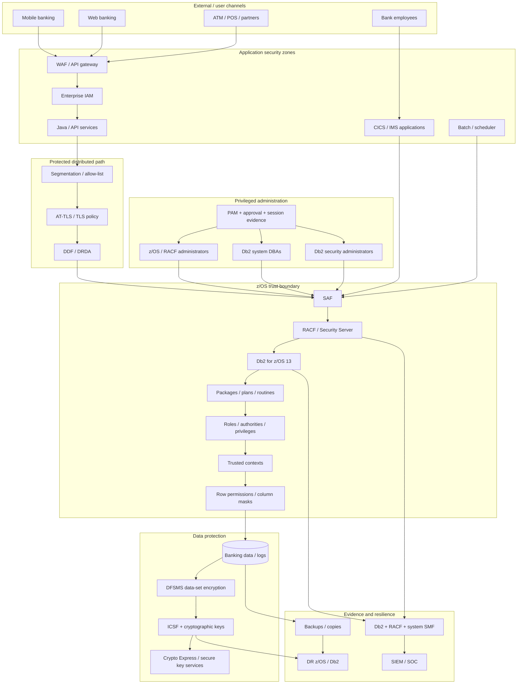

# Reference architecture: Db2 for z/OS banking security

Use this as a **design checklist**, not as a universal network blueprint. Adapt subsystem topology, transaction managers, identity mechanisms, cryptographic services and regulator scope to the institution.

## End-to-end architecture

## Control planes

### 1. Identity plane

**Objective:** every human/workload request resolves to an intended, owned identity.

Controls:

- enterprise identity proofing and lifecycle;
- SAF/RACF user/group/resource protection;
- primary/secondary Db2 authorization IDs;
- service/NHI owner and source binding;
- break-glass identity lifecycle;
- recertification.

Evidence:

- RACF user/group/profile state;
- IAM/PAM records;
- authentication events;
- effective-access calculation.

### 2. Authorization plane

**Objective:** identity can perform only required operations.

Controls:

- SYSADM/SECADM/system DBADM separation;
- ACCESSCTRL/DATAACCESS discipline;
- roles;
- object privileges;
- package EXECUTE;
- row permissions and column masks;
- trusted contexts;
- negative testing.

### 3. Application execution plane

**Objective:** production SQL is controlled like application code.

Controls:

- static package governance;
- BIND/REBIND separation;
- parameterized dynamic SQL;
- package/change linkage;
- CICS/IMS/batch identity mapping;
- secure software supply chain.

### 4. Distributed network plane

**Objective:** only approved workloads reach DDF over an approved protected path.

Controls:

- segmentation/allow-list;
- AT-TLS/TLS;
- certificate lifecycle;
- approved authentication mechanism;
- source anomaly monitoring;
- fail-secure behaviour.

### 5. Data-protection plane

**Objective:** sensitive data exposure is minimised in storage and legitimate access paths.

Controls:

- data classification;
- row/column policy;
- DFSMS data-set encryption;
- ICSF/key lifecycle;
- backup encryption/protection;
- data minimisation/tokenisation where required.

### 6. Evidence plane

**Objective:** security-relevant activity is attributable and reconstructable.

Controls:

- Db2 audit policies/traces/IFCIDs;
- SMF collection;
- RACF events;
- PAM/application correlation;
- protected retention;
- SIEM detections;
- retrieval tests.

### 7. Resilience plane

**Objective:** security remains effective through outage and recovery.

Controls:

- Db2 backup/recovery;
- DR subsystem;
- cryptographic key availability;
- RACF/security profile recovery;
- DDF certificate/endpoint readiness;
- emergency access;
- post-recovery security validation.

## Minimum production security baseline

A mature baseline should be able to answer **yes** to questions such as:

### Identity
- Is every privileged user individually attributable?
- Does every NHI have an owner, purpose, source, credential lifecycle and expiry/recertification?
- Are dormant and orphaned IDs detectable?

### Authorization
- Is normal DBA administration separated from business-data access where feasible?
- Is security administration separately governed?
- Are direct sensitive base-table grants exceptional?
- Are negative access tests documented?

### DDF
- Are production distributed paths explicitly inventoried?
- Is approved TLS/AT-TLS protection enforced and monitored?
- Are certificate owners/expiry SLOs defined?
- Is the resulting Db2 authorization context tested?

### Data
- Are sensitive rows/columns minimised by persona?
- Is full PAN/PII retrieval limited to justified contexts?
- Are encryption/key dependencies documented through DR?

### Audit
- Can the SOC detect privileged sensitive reads, privilege changes and abnormal service-account access?
- Can events be tied to PAM/application context?
- Is retention protected and tested?

### Resilience
- Has the encrypted service been recovered at DR with real key/security dependencies?
- Does break-glass access expire and leave evidence?
- Are normal security controls revalidated after recovery?

## Ownership model

| Control | Accountable owner | Key contributors |
|---|---|---|
| RACF identity/resource design | z/OS security / IAM | Db2, app owners, audit |
| Db2 administrative authority | Db2 security owner | DBA management, z/OS security |
| Packages / BIND governance | Application/platform owner | DBA, DevSecOps, change management |
| DDF / AT-TLS | Network + Db2 service owner | z/OS Communications, IAM, app teams |
| Row/column data policy | Data owner | SECADM, app owner, privacy |
| DFSMS / ICSF / keys | Crypto/storage security owner | RACF, Db2, DR |
| Db2/SMF monitoring | SOC / security monitoring | DBA, RACF, platform logging |
| Regulatory mapping | Compliance/risk/legal | Security, privacy, PCI owner, technology owners |
| DR security validation | Resilience owner | DBA, crypto, RACF, application owner |

## Architecture review questions

Use these during design reviews:

1. What happens if the application service credential is stolen?
2. What happens if a DBA account is compromised?
3. What happens if SECADM changes a mask/permission maliciously?
4. What happens if the DDF certificate expires tonight?
5. What happens if a trusted-context connection arrives from an unexpected source?
6. What happens if application authorization fails but Db2 base-table privilege is broad?
7. What happens if SMF forwarding stops for four hours?
8. What happens if the DR system lacks the newest encryption key?
9. What happens if a temporary emergency group does not expire?
10. Which control independently detects each of those failures?

If the answer to every question is “the same administrator will notice,” the design needs more separation and automated evidence.
